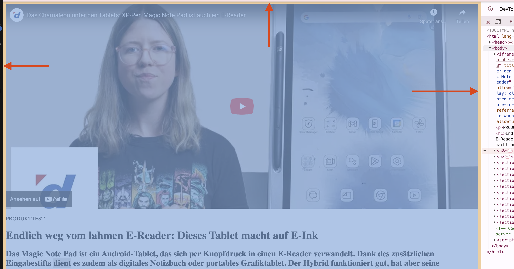
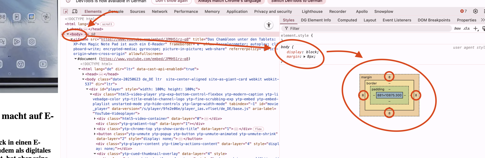

# 🗺️ Basis
## Setup-Prozess

Damit wir überhaupt CSS ergänzen können, brauchen wir unser CSS:

### **Schritt 1: Neuen Ordner erstellen**
- **Neuen Ordner** erstellen: `html_blog_page_with_css`

### **Schritt 2: HTML kopieren**
- **HTML aus der HTML-Übung** in den neuen Ordner kopieren
- **Alternative**: Von [GitHub](https://github.com/rekoch/webEngineerDgEditors/tree/main/public/01_html) herunterladen

### **Schritt 3: CSS-Datei erstellen**
- **`main.css`** im neuen Ordner erstellen

### **Schritt 4: CSS verknüpfen**
Im `index.html` den CSS-Import ergänzen:

```html
<head>
    <meta charset="UTF-8" />
    <meta name="viewport" content="width=device-width, initial-scale=1.0" />
    <title>blog page 37832</title>
    <link rel="stylesheet" href="main.css">
</head>
```

**✅ Jetzt kannst du in diesem CSS Styles für deine Webseite einsetzen!**

---

# Das Ding mit den User Agent Stylesheets

Wir wollen als erstes den äusseren Rand der Seite definieren. Nun kriegen wir etwas das Problem, dass es User Agent Stylesheets gibt, die uns allenfalls in die Quere kommen. Wir wollen also nicht einfach einen neuen Rand hinzufügen, sondern den bestehenden anpassen.

## Margin-Problem analysieren

### **Schritt 1: LiveServer starten**
- **Rechtsklick** auf `index.html`
- **"LiveServer"** auswählen

### **Schritt 2: Chrome DevTools öffnen**
- **Seite in Chrome** öffnen
- **Entwickler-Werkzeug** aktivieren

### **Schritt 3: Element inspizieren**
- **Auswahl-Werkzeug** aktivieren
- **Mit Maus** über verschiedene Elemente fahren
- **Bei "äusseren" Elementen**: Orange Farbe um die ganze Page



### **Schritt 4: Margin verstehen**
- **Orange Farben** = Margins
- **Grüne Farben** = Paddings
- **Body-Element** hat `8px margin` als Standard



> 💡 **Erkenntniss**: Wir müssen den **`body`**-Selektor übersteuern, um genau diesen Wert zu vergrössern!

## CSS-Lösung implementieren

### **Body-Margin anpassen:**

```css
body {
  margin: 20px;
}
```

**Teste verschiedene Werte und überprüfe das Ergebnis!**

---

# Weitere Anpassungen

Damit die Page immer mehr der [Galaxus-Vorlage](https://www.galaxus.ch/de/page/endlich-weg-vom-lahmen-e-reader-dieses-tablet-macht-auf-e-ink-37832) entspricht, passen wir weitere Elemente an.

## iFrame responsive machen

Das eingebundene iFrame ganz am Anfang stört gewaltig durch die definierte Breite und Höhe. Wir wollen dies per CSS definieren.

### **HTML bereinigen:**
- **Höhe und Breite** aus dem HTML entfernen

### **CSS-Lösung:**
```css
iframe {
  width: 100%;
  aspect-ratio: 16 / 9;
  height: auto;
  display: block;
}
```

> ⚠️ **Wichtig**: Min-height müssen wir bei einem iFrame definieren. Ansonsten wird es "zerquetscht"!

## Bilder responsive machen

Die Bilder haben auch noch eine falsche Grösse. Definiere den Selektor auf alle `img`s:

```css
img {
  max-width: 100%;
  height: auto;
}
```

**✅ Resultat**: Die maximale Breite wird auf 100% der ganzen Seite gesetzt und so "sprengen" die Bilder das Layout in der Breite nicht mehr.

---

# 🎯 Nächste Schritte

Nach diesen Grundlagen-Anpassungen:

1. **Typography** verfeinern
2. **Farben** hinzufügen  
3. **Layout** optimieren
4. **Responsive** Design implementieren

**Die Basis steht - jetzt wird es kreativ!** 🚀
