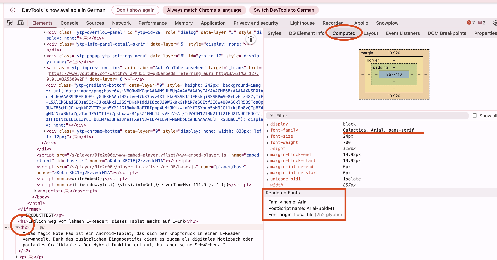
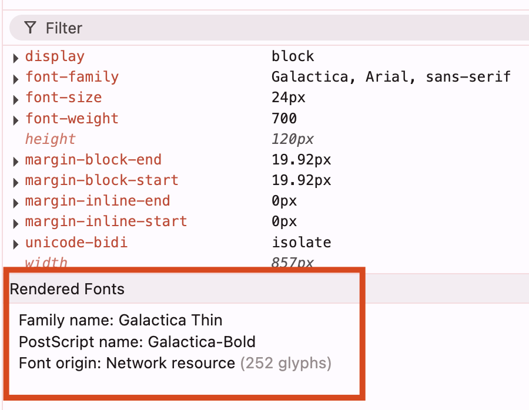

# 📚 Font und Schriftgrösse anpassen

Diese wenigen Anpassungen haben schon einen starken Effekt auf das Optische. Basierend auf der Vorlage müssen wir uns auch noch Schrift und Schriftgrösse anschauen.

## Font-Family analysieren

Wenn du z.B. das Titel-Element H2 untersuchst, findest du folgende Definition:

```css
font-family: Galactica, Arial, sans-serif;
```

## Body-Font definieren

Wir ergänzen die Schrift auf unsere ganze Page im CSS mittels dem Body-Selektor:

```css
body {
  margin: 20px;
  font-family: Galactica, Arial, sans-serif;
}
```

## Computed Styles überprüfen

Wenn du deine Seite nochmals untersuchst, wirst du eine Änderung feststellen. Aber irgendwie stimmt die Schrift noch nicht. Du kannst über **"Computed"** genau sehen, welche Schrift dein Browser ausgewählt hat.



**Fallback-Mechanismus:**
1. **Galactica** versuchen → nicht gefunden
2. **Arial** versuchen → ✅ gefunden und verwendet
3. **sans-serif** als letzte Option

> ⚠️ **Problem**: Es rendert die Schrift "Arial", da **Galactica** nicht verfügbar ist.

---

# Custom Font laden

Wir wollen aber die selbe Schrift wie in der Vorlage. Dazu müssen wir die Schrift zuerst laden.

## Font-Loading Grundlagen

**Referenz**: [W3Schools CSS3 Fonts](https://www.w3schools.com/css/css3_fonts.asp)

## Font-URL finden

Die URL auf den Font ist auf der [Galaxus-Seite](https://www.galaxus.ch/de/page/endlich-weg-vom-lahmen-e-reader-dieses-tablet-macht-auf-e-ink-37832) zu finden:

**Original-Pfad:** `/static/fonts/Galactica/galactica-2024-12-19.woff2`

**Vollständige URL:** `https://static.digitecgalaxus.ch/static/fonts/Galactica/galactica-2024-12-19.woff2`

## @font-face implementieren

```css
@font-face {
  font-family: 'Galactica';
  src: url("https://static.digitecgalaxus.ch/static/fonts/Galactica/galactica-2024-12-19.woff2") format('woff2');
}
```



**✅ Lade die Page neu** und du wirst sehen, dass nun tatsächlich die **Galactica-Schrift** verwendet wird!

---

# Schriftgrössen und Gewichte definieren

Damit auch die Grössen und font-weight aller Texte stimmen, gehe durch die Elemente aus der Vorlage durch und definiere es entsprechend in deinem CSS.

## H1-Element Beispiel

**Aus der Vorlage extrahierte Werte:**
- **font-weight:** 650
- **font-stretch:** normal  
- **line-height:** 36px
- **font-size:** 30px

```css
h1 {
  font-weight: 650;
  font-stretch: normal;
  line-height: 36px;
  font-size: 30px;
}
```

## Systematisches Vorgehen

1. **H1-H4 Elemente** durchgehen
2. **P-Tags** analysieren
3. **Werte aus Vorlage** übernehmen

> ⚠️ **Beachte**: Falls du den Lead als H2 und weitere als H3 definiert hast, musst du das beim Kopieren entsprechend berücksichtigen!

---

# Globale Text-Optimierungen

Vermutlich gibt es jetzt immer noch klare optische Unterschiede. Ein paar zusätzliche Definitionen kannst du mit einem `*` für alle Elemente hinzufügen:

## Universal-Selector

```css
* {
  text-wrap-mode: wrap;
  text-wrap-style: pretty;
  overflow-wrap: break-word;
  color-scheme: light;
  -webkit-font-smoothing: antialiased;
}
```

## P-Tag Letter-Spacing

```css
p {
  font-weight: 400;
  font-stretch: normal;
  line-height: 28px;
  font-size: 18px;
  letter-spacing: 0.005em;
}
```

---

# Browser-spezifische Optimierungen

## -webkit-font-smoothing

Das `-webkit-font-smoothing` ist etwas speziell und wird [hier nicht unbedingt empfohlen](https://developer.mozilla.org/en-US/docs/Web/CSS/font-smooth), weil es nicht alle Browser unterstützen.

**Aber**: Es macht im Chrome einen wesentlichen optischen Unterschied!

## A/B Test

**Teste es mit und ohne:**
- **Ohne**: Text wirkt beinahe "zu fett" oder "blurry"
- **Mit**: Schärfere, glattere Darstellung

## Weitere Verbesserungen

Die weiteren Definitionen machen die Umbrüche etc. noch etwas besser:
- **text-wrap-mode**: Intelligentere Textumbrüche
- **text-wrap-style**: Schönere Zeilenumbrüche
- **overflow-wrap**: Besseres Verhalten bei langen Wörtern

**Typography-Grundlage ist gelegt!** 🎉
