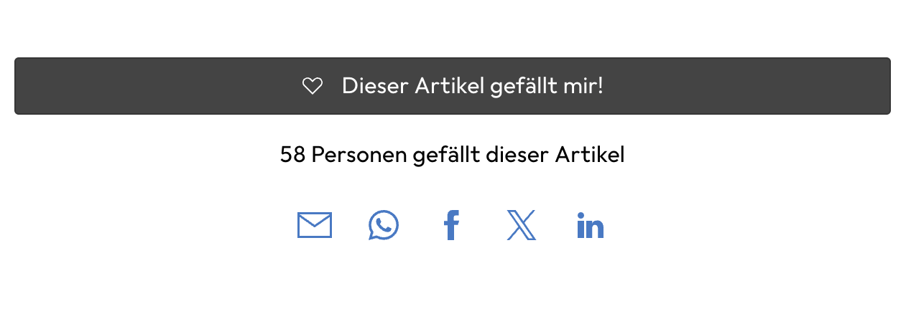
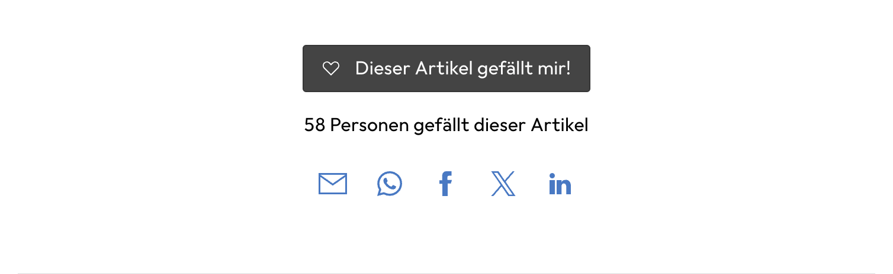
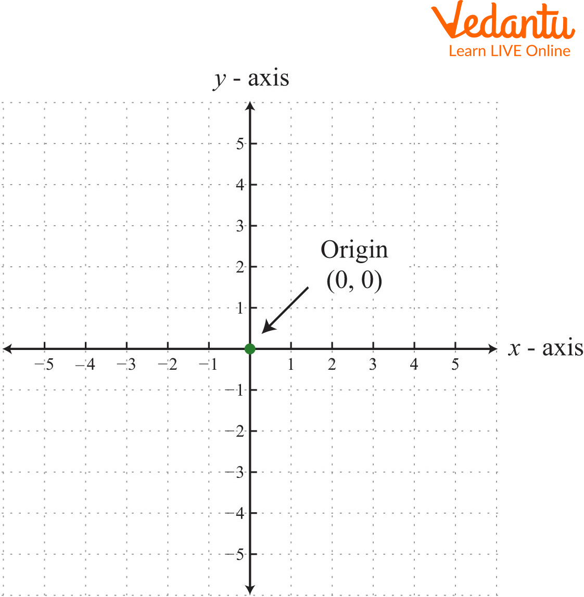
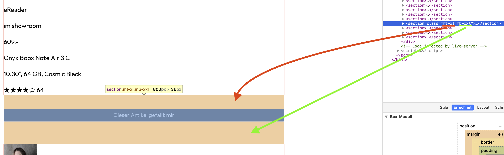
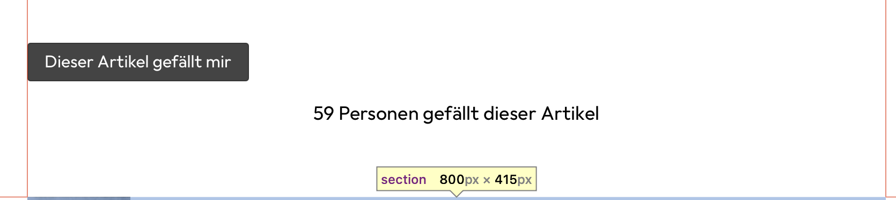
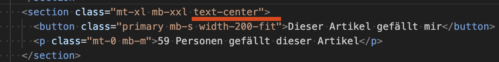

# ❤️ Like Bereich

## Responsive Layout-Unterschiede

Der "Like"-Bereich enthält keine neuen Elemente (ausser noch der "# Personen gefällt dieser Artikel"). Vor allem aber definiert der Bereich verschiedene Layouts für Mobile und Desktop, damit alles etwas besser passt.

### Layout-Vergleich

| Mobile | Desktop |
|--------|---------|
|  |   |

---

## CSS-Methodik: Utility-First

Wir können für diesen Bereich ein eigenes CSS anlegen oder gezielte CSS-Klassen schreiben, die etwas allgemeiner gehalten sind. Dadurch kann die **Wiederverwendung** erhöht werden.

### Utility-First Ansatz

**Anstelle:** `"blog-page-like-button"`  
**Verwende:** Mehrere Klassen die den jeweiligen Anwendungszweck beschreiben  
**Beispiel:** `"margin-bottom-small"` oder ähnlich

### CSS-Methodologien

Diese Art von CSS nennt sich **"Utility-First"** und wird etwa von der CSS-Bibliothek **Tailwind** und teilweise von **Bootstrap** verwendet.

**Unser Ansatz:** Kombination von:
- **Utility-Klassen** (Utility-First CSS)
- **Komponenten-basierten/semantischen Klassen** (OOCSS)

> 📖 **Mehr Infos**: [CSS Methodologies Guide](https://medium.com/@hossein.khoshnevis77/understanding-and-implementing-css-methodologies-a-guide-for-web-developers-572983f0e9fe)

---

## Utilities.css erstellen

### Setup

Erstelle ein neues CSS-File **`utilities.css`** und importiere es im `main.css`:

```css
@import url("utilities.css");
```

### Margin-Werte analysieren

Wenn du die Vorlage auf Desktop-Grösse untersuchst und nach verschiedenen Margins Ausschau hältst, wirst du verschiedene Angaben finden:

| Wert | Bezeichnung | Abkürzung |
|------|-------------|-----------|
| **0px** | Zero | `0` |
| **16px** | Small | `s` |
| **24px** | Medium | `m` |
| **32px** | Large | `l` |
| **40px** | X-Large | `xl` |
| **64px** | XX-Large | `xxl` |

### Koordinatensystem verstehen



**Für oben/unten bzw. rechts/links** wird gerne `y` bzw. `x` benutzt, welches aus dem klassischen Koordinatensystem stammt.

### Naming Convention

**Für "margin top small"** machen wir `mt-s` draus:
- **m** = margin
- **t** = top  
- **s** = small

---

## Utility-Klassen implementieren

### Margin-Top Utilities

```css
/* margin-top utilities */
.mt-0 {
    margin-top: 0;
}
.mt-s {
    margin-top: 16px;
}
.mt-m {
  margin-top: 24px;
}
.mt-l {
  margin-top: 32px;
}
.mt-xl {
  margin-top: 40px;
}
.mt-xxl {
  margin-top: 64px;
}
```

### Margin-Bottom Utilities

```css
/* margin-bottom utilities */
.mb-0 {
  margin-bottom: 0;
}
.mb-s {
  margin-bottom: 16px;
}
.mb-m {
  margin-bottom: 24px;
}
.mb-l {
  margin-bottom: 32px;
}
.mb-xl {
  margin-bottom: 40px;
}
.mb-xxl {
  margin-bottom: 64px;
}
```

### Margin Vertical Utilities

```css
/* margin-top and bottom utilities */
.my-0 {
  margin-top: 0;
  margin-bottom: 0;
}
.my-s {
  margin-top: 16px;
  margin-bottom: 16px;
}
.my-m {
  margin-top: 24px;
  margin-bottom: 24px;
}
.my-l {
  margin-top: 32px;
  margin-bottom: 32px;
}
.my-xl {
  margin-top: 40px;
  margin-bottom: 40px;
}
.my-xxl {
  margin-top: 64px;
  margin-bottom: 64px;
}
```

### HTML-Anwendung

Nachdem nun die CSS-Klassen erstellt sind, fülle im HTML nun dort die Klassen ein, wo sie entsprechend für ein Margin sorgen.



---

## ✅ Progress Tracking

### 📋 Stand Like-Bereich:
- ✅ **Abstände oben und unten**
- ❌ **Text unter dem Button** zentriert mit richtigen Abständen
- ❌ **Breite des Like-Buttons**

---

## Text unter dem Button

### Text-Alignment

Du hast bereits die nötigen margins für die Abstände definiert und musst sie nur noch korrekt einsetzen im HTML. Allenfalls musst du etwas mit `"0"` aushelfen, wenn das User Agent Stylesheet dazwischen funkt.

**Für's Zentrieren** gibt es grundsätzlich verschiedene Varianten. Die einfachste für den Fall ist aber `text-align: center`.

### Text Utilities

```css
/* text utilities */
.text-center {
  text-align: center;
}
.text-left {
  text-align: left;
}
.text-right {
  text-align: right;
}
.text-justify {
  text-align: justify;
}
```


### ✅ Updated Progress:
- ✅ **Abstände oben und unten**
- ✅ **Text zentriert** mit richtigen Abständen
- ❌ **Breite des Like-Buttons**

---

##  Breite des Bereichs

### Desktop-Analyse

Der Bereich ist in den verschiedenen Elementen in der Breite schmaler. Im Prinzip könnte man einfach der ganzen Section eine Breite verpassen. Die Vorlage nutzt aber tatsächlich Einschränkungen auf dem **Button und dem Text** darunter selbst.

**Untersuche mit dem Browser** die Elemente. Dann wirst du sehen, dass beim Desktop folgendes steht:
- **width:** `fit-content`
- **min-width:** `200px`

### Button-CSS erweitern

Da dies sehr spezifisch ist, macht es Sinn, beim `button.css` eine Spezialbreite einzuführen:

```css
&.width-200-fit {
    min-width: 200px;
    width: fit-content;
}
```

### HTML erweitern

```html
<button class="primary width-200-fit">❤️ Gefällt mir</button>
```



### Zentrierung korrigieren

Erst jetzt fällt auf, dass der Button eigentlich linksseitig orientiert ist. Auch das sollten wir ändern.

**Der Trick** ist relativ simpel: Anstelle das `"text-center"` auf dem Text selbst zu vergeben, setzt du die CSS-Klasse auf dem **section container**, welcher Button und Text vereint. Somit kriegen alle Elemente zentriert.



> 🎉 **Falls du das von Beginn an so gemacht hast, umso besser!**

### ✅ Final Progress:
- ✅ **Abstände oben und unten**
- ✅ **Text zentriert** mit richtigen Abständen  
- ✅ **Breite des Like-Buttons**

---

## Ein ❤️ für Details

Falls du willst und magst, kannst du im Like-Bereich noch 2-3 Details beheben:

### Font-Size Anpassung
**Wenn du genau hinschaust**, ist die Font-Size hier kleiner als üblich. Versuche herauszufinden wie gross und finde einen Weg mit CSS, dies anzupassen.

### SVG-Herz im Button
**Das Herz im Button** ist ein SVG und sollte weiss sein. Zudem gibt es dort noch einen Abstand und alles sollte auf der selben Höhe liegen. All das ist eher schwierig. Wenn du dich fit dafür fühlst, versuche es. Es muss aber auch nicht sein.

### Endlösung

**Du findest den Endstand** der Lösung auf [GitHub](https://github.com/rekoch/webEngineerDgEditors/tree/main/public/02_html_css/05_like_with_icon)

**Like-Bereich ist responsive und professionell umgesetzt!** 🎉
