# 🔭 Blog Page Preview

## Verschiedene Ansichten

Die Blog Page Preview gibt es an verschiedenen Orten und Formaten:

### Layout-Vergleich

| Ansicht | Mobile | Desktop |
|---------|--------|---------|
| **Einzelne Page** | 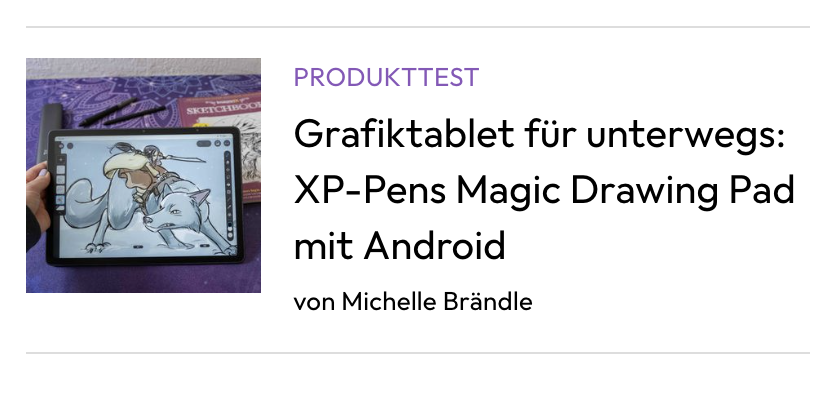 | 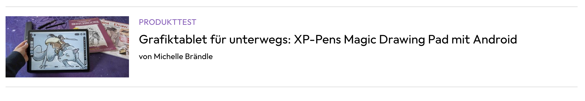 |
| **Listenansicht** | 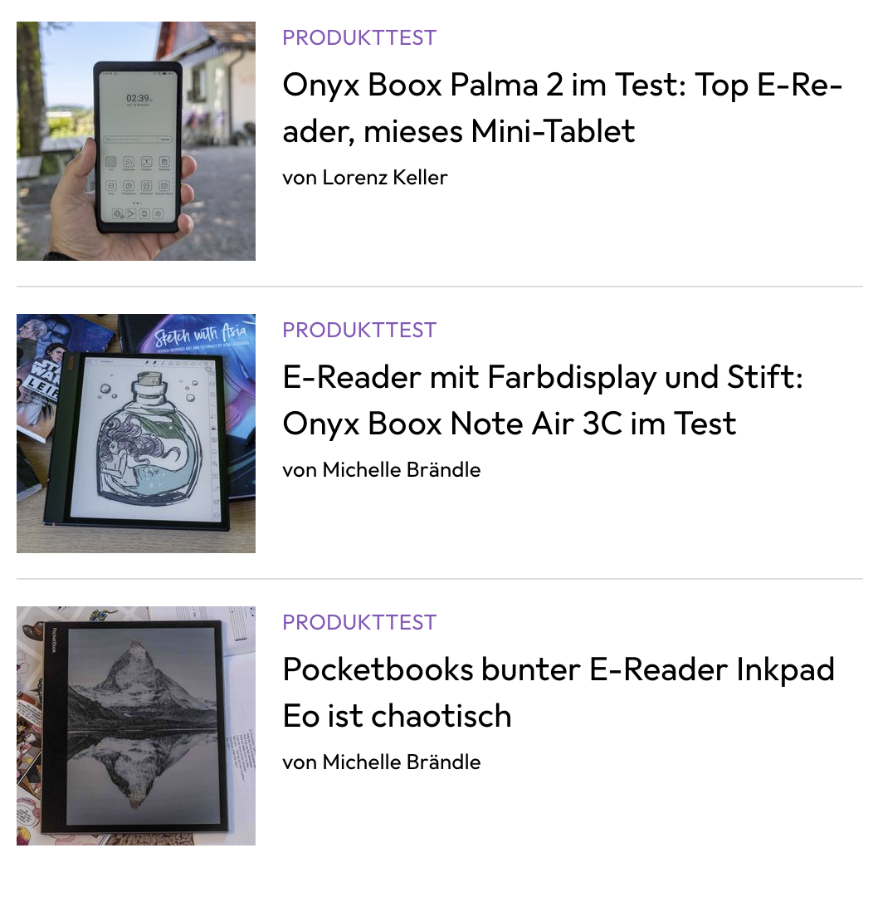 | 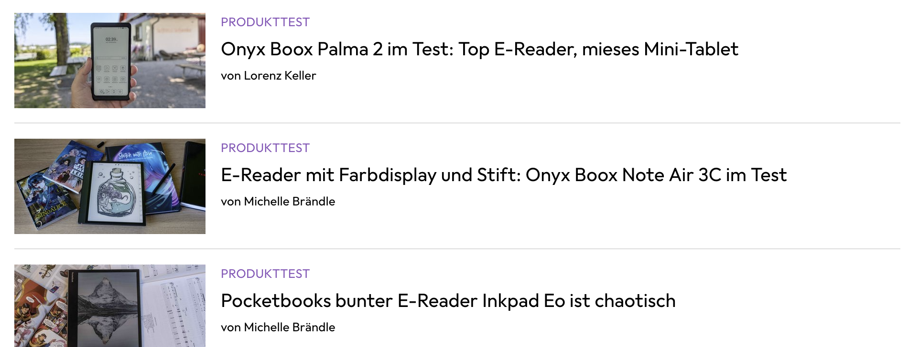 |

> 💡 **Glück**: Die Änderungen sind minimal zwischen den Versionen. Wir können uns auf die Mobile konzentrieren und haben ev. die restlichen Varianten bereits mit abgebildet.

---

## Flexbox implementieren

### Lernressourcen

Damit wir das Design umsetzen können, nutzen wir **Flexbox**:

- **[Flexbox Froggy](https://flexboxfroggy.com/#de)** 🐸 (Interaktives Tutorial)
- **[CSS-Tricks Guide](https://css-tricks.com/snippets/css/a-guide-to-flexbox/)** 📖 (Komplette Referenz)

### Element-Auswahl

Starte auf dem Element, welches diese Blog Page umschliesst.

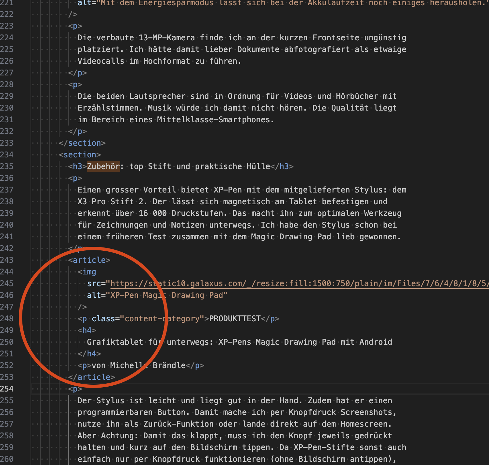

---

## Utilities erweitern

### Flexbox-Utilities hinzufügen

Damit wir Flexbox verwenden können, brauchen wir im `utilities.css` die folgenden Klassen:

```css
/* Flexbox utilities */
.d-flex {
  display: flex;
}

.flex-row {
  flex-direction: row;
}

.flex-column {
  flex-direction: column;
}
```

### HTML-Implementation

Setze die beiden Klassen `d-flex` und `flex-row` auf dem HTML-Element **`article`** und prüfe, was passiert.

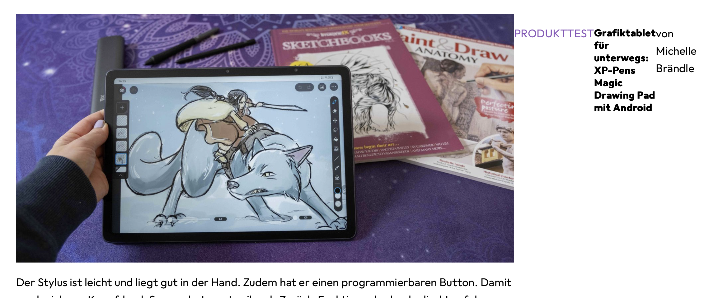

**✅ Resultat**: Die Text-Elemente sind schon mal rechts vom Bild. Eigentlich genau was wir möchten!

---

## Bild-Spezialbehandlung

### Problem

Das Bild benötigt relativ viele spezielle Behandlungen, damit es passt. Damit du nicht zu viele Klassen schreiben musst, erstelle eine **`flex-image-aside`** Klasse.

### CSS-Implementation

```css
.flex-image-aside {
  flex: 0 1 30%;  /* Kurzschreibweise für grow, shrink, basis */
  max-width: 144px;
}
```

### HTML-Anwendung

Vergib diese Klasse dem Bild:

```html

```

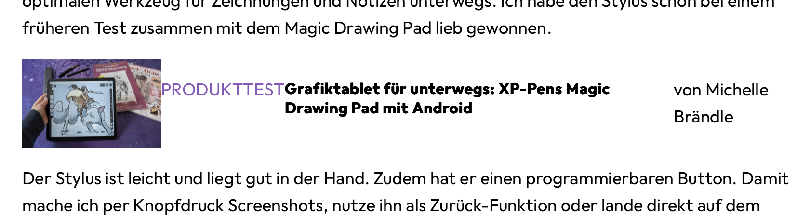
---

## Flex Direction anpassen

**Von Row zu Column**

Jetzt müssen wir im **"rechten"** Bereich wiederum statt nebeneinander das Ganze untereinander haben. Also von **"row"** zu **"column"**.

> **Ahnst du schon**, wie du das mit Flexbox machen kannst?

### Container hinzufügen

Falls dir ein Container fehlt, um diese Elemente zu umschliessen, kannst du ein **`div`** HTML-Element nutzen. Diese eignen sich super, um vor allem CSS-Klassen zu setzen.

```html
<article class="d-flex flex-row">
  
  <div class="d-flex flex-column">
    <h3>Titel</h3>
    <p>Beschreibung</p>
  </div>
</article>
```

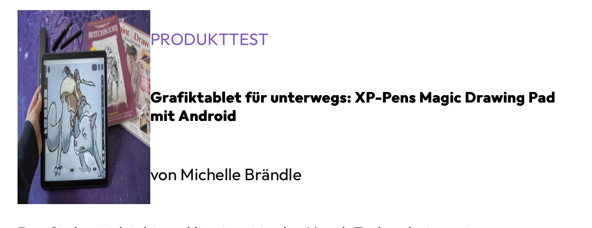

### Bildverzerrung beheben

**Typisch Entwicklung**: Man löst ein Problem und schafft sich neue... Wunderbar oder? 

**Problem**: Das Bild ist jetzt komplett verzogen.

**Lösung**: `object-fit: cover`
```css
.flex-image-aside {
  flex: 0 1 30%;  /* Kurzschreibweise für grow, shrink, basis */
  max-width: 144px;
  object-fit: cover; /* Verhindert Verzerrung */
}
```

---

## Spacing-Optimierungen
Jetzt stören noch die Abstände oben / unten zwischen den Texten sowie sind Bild und Text zu nah aneinander. 

**Nutze deine Utility-Klassen** um die Abstände anzupassen:
- **mr-s** für rechten Abstand am Bild
- **my-0** um vertikale Margins zu entfernen


Danach müssen wir uns noch um die Schriftgrössen kümmern. Die sind jeweils 13 und 20. Zwischen dem Bild und dem Text gibt es einen Abstand von 16px.
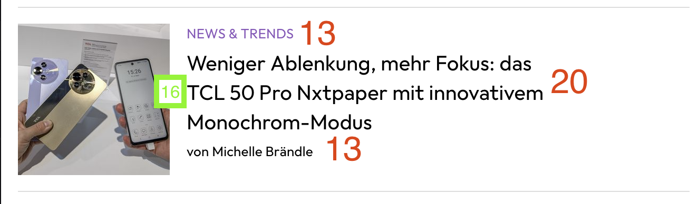
Als Margin-Top bei allen Texten sind 4px definiert. Wir brauchen also doch noch so was wie ein xxs.

### Anpassungen vornehmen
Damit alles klappt musst du noch die Fonts im `fonts.css` erweitern. Ausserdem brauchen wir neue Werte für die Font-Weights. Die `fonts.css` könnte nun so aussehen (die Werte wie 13, 20 kannst du auch durch small, large oder ähnlich ersetzen).

```css
.font-13 {
  font-size: 13px;
  line-height: 20px;
}
.font-20 {
  font-size: 20px;
  line-height: 28px;
}
.font-weight-regular {
  font-weight: 400;
}
.font-weight-medium {
  font-weight: 500;
}
.font-weight-bold {
  font-weight: 700;
}
```

Setzte dann die Klassen im Html alle. Achte darauf dass du die `my-0` durch `mt-s` und `mb-0` ersetzen musst, dort wo es ein `mt-s` gibt.

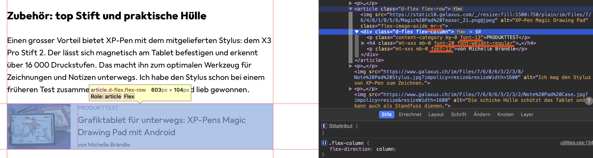


### Nur noch ein paar Details

Jetzt fehlen uns nur noch diese hübschen Linien oben und unten. Das sind einfache Border die wir ebenfalls im `utilities.css` definieren können. Auch hier könnten die Farben und Dicken jeweils über Variablen ausgelagert werden.

```css
.border-top {
  border-top: 1px solid #ddd;
}
.border-bottom {
  border-bottom: 1px solid #ddd;
}
```

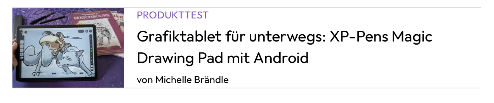

Jetzt sind die Linien noch zu nah. Das können wir mit Padding korrigieren, da eine Border zwischen padding und Margin liegt.

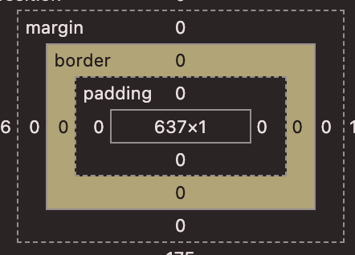

Gemäss Vorlag gibt es ein Padding oben und unten von 16px. Erweitere deine `utilitites.css` mit Paddings und setze danach die Klassen ein.

Da wir für margin und padding die selben Werte nutzen, legen wir sie gleich zusammen in den Variablen zu `spaces` und nutzen im `utilties.css` dann dieselbe Variable für Margin und Padding Angaben.

**`Variables.css`**
```css
/* general spaces variables */
:root {
  --space-xxs: 4px;
  --space-xs: 12px;
  --space-s: 16px;
  --space-m: 24px;
  --space-l: 32px;
  --space-xl: 40px;
  --space-xxl: 64px;
}
```

**`Utilities.css`**
```css
/* margin-top utilities */
.mt-0{
    margin-top: 0;
}
.mt-xxs {
  margin-top: var(--space-xxs);
}
.mt-xs {
…
…

/* padding-top utilities */
.pt-0 {
  padding-top: 0;
}
.pt-xxs {
  padding-top: var(--space-xxs);
}
…
…
```

Setze dann py-s auf das Article Element

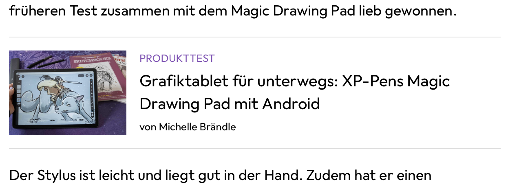

### Fleissarbeit…
Jetzt hast du alle Grundlagen im CSS, um all die Blog Page Previews zu gestalten. Gehe durch jede Stelle in der Index.html Seite durch, ergänze die Klassen und es sollte soweit passen. Für Desktop könnte man das Bild noch etwas breiter machen. Aber das ist deine Wahl ob du das noch machen möchtest 😊 Viel Erfolg!

Ps. Du findest die fertige Version auf Github https://github.com/rekoch/webEngineerDgEditors/tree/main/public/02_html_css/08_blog_page_preview
