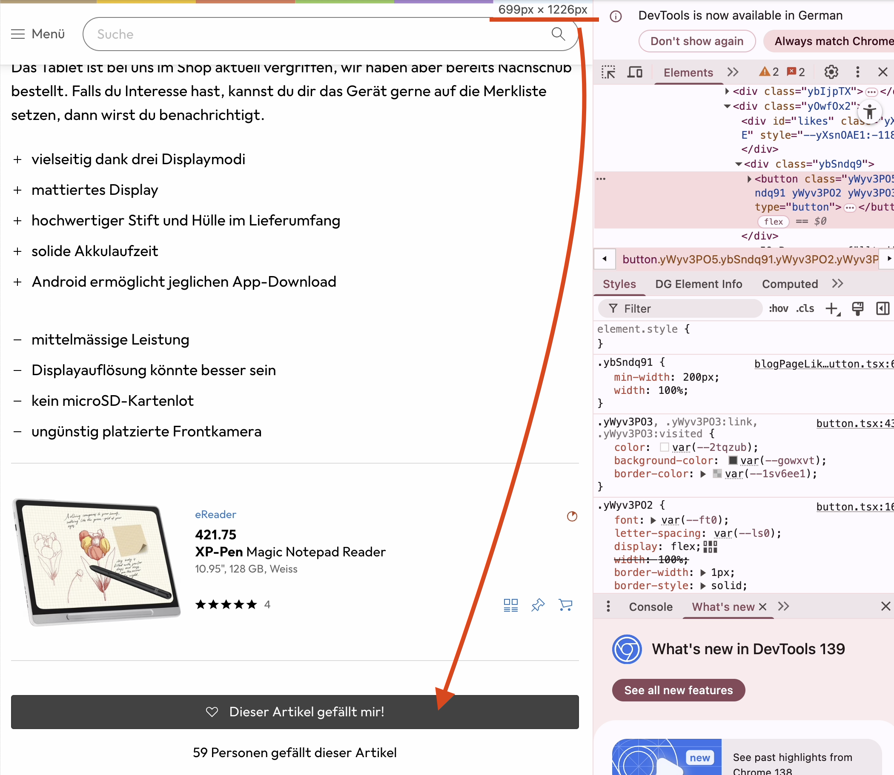
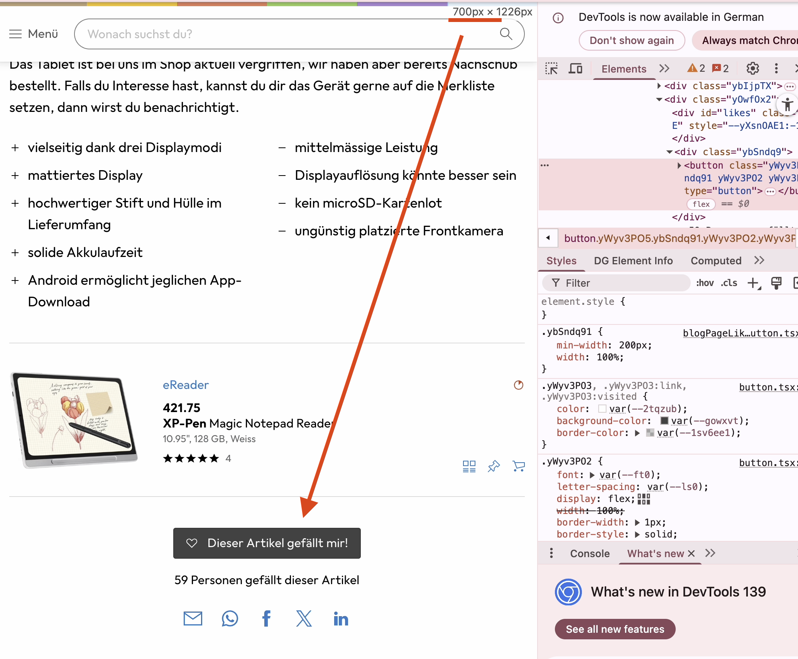
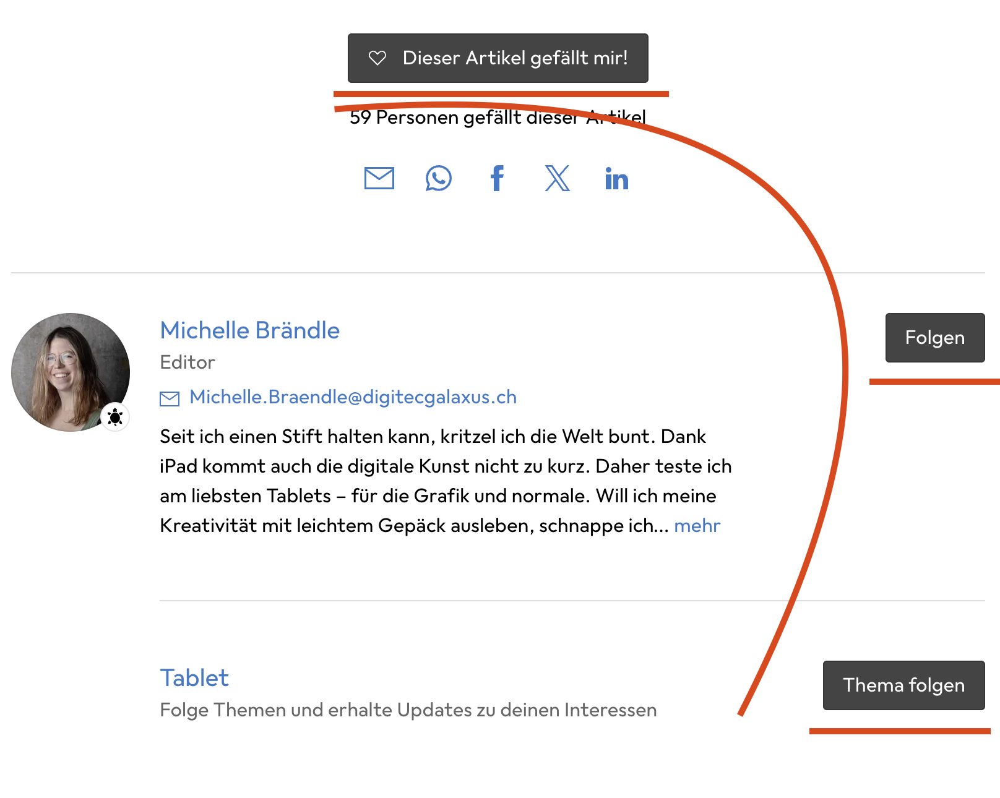

# Responsive is key

## 🎯 Warum Responsive Design?

Wenn wir eine Page für möglichst viele Endgeräte nutzen wollen, sollten wir sie **responsive** gestalten. 

> 📖 **Siehe auch**: [Responsive Web Design Guide](../rwd.md)

> 💡 **Falls du nicht klarkommst**, nutze den Stand aus [GitHub](https://github.com/rekoch/webEngineerDgEditors/tree/main/public/02_html_css/06_variables)

---

## Mobile First?

### Desktop First vs. Mobile First

Wenn wir eine Seite responsive gestalten, sollten wir uns festlegen:

| Ansatz | Beschreibung | Heute empfohlen? |
|--------|--------------|------------------|
| **Desktop First** | Zuerst Desktop, dann kleiner | ❌ Veraltet |
| **Mobile First** | Zuerst Mobile, dann grösser | ✅ Standard |

### Was bedeutet Mobile First?

**Grundsatz**: Wir gehen immer davon aus, dass es ein **Mobile-Gerät mit schmalem Screen** ist.

#### **Praktische Beispiele:**

| Element | Mobile | Desktop | Grund |
|---------|--------|---------|-------|
| **Margins** | 0px | 24px | Mehr Platz verfügbar |
| **Button-Breite** | 100% | fit-content | Schmaler Screen nutzen |
| **Font-Size** | 16px | 18px | Bessere Lesbarkeit |

> **Fazit**: CSS für Mobile definieren, dann für breitere Bildschirme erweitern!

---

## Breakpoints definieren

### Galaxus Design System

Damit wir überhaupt verschiedene Bildschirmbreiten unterstützen, müssen wir **Breakpoints** definieren.

**Breakpoints** = Stellen im Screen, wo wir sagen *"hey, jetzt sollte ich etwas am Design anpassen"*

### Galaxus Breakpoints

**Referenz**: [Galaxus Screen Ranges](https://www.galaxus.ch/designsystem/foundations/screen-ranges-and-breakpoints)

| Range | Breite | Geräte |
|-------|--------|--------|
| **zero → xs** | 0 - 699px | Mobile |
| **xs → s** | 700px - 999px | Tablet |
| **s → m** | 1000px+ | Desktop |

---

## Media Queries - Button responsive machen

### CSS-Magie: Media Queries

**Media Queries** ermöglichen, auf den aktuellen Screen dynamisch zu reagieren.

**Regel**: Bis zum ersten Breakpoint gilt **Mobile** → da müssen wir nichts Spezielles tun.

### Button-Problem analysieren

Der **Like-Button** ist auf Mobile zu schmal und sollte die ganze Breite einnehmen, damit er optisch besser wirkt.

#### **Browser-Analyse mit Dev Tool:**
- **bis 700px**: Button volle Breite 
- **ab 700px**: Button schmal

### Responsive-Verhalten

| zero → xs (699px) | xs (700px) → ∞ |
|-------------|------------------|
| | 

Für unseren Button bedeutet dies, wir müssen ihn beim xs-breakpoint auf schmal definieren. Gehe dazu erneut zum button.css file und suche die Stelle raus, die wir mit einem zusätzlichen CSS definiert haben.

---

## CSS-Implementation
Wir können mit einem Media Query den Button so direkt übersteuern, dass er ab dem xs-breakpoint schmal bleibt. Dafür entfernen wir unsere spezialklasse wieder, die wir zuvor angelegt haben.

```css
/* ENTFERNEN: */
&.width-200-fit {
    min-width: 200px;
    width: fit-content;
}
```

### Media Query hinzufügen

**Neues Button.css** mit Media Query:

```css
button {
  background-color: #eee;
  color: #000;
  border: 1px solid #0003;
  border-radius: 3px;
  padding: 7px 15px;
  width: 100%; /* Mobile First: Volle Breite */
  cursor: pointer;
  text-align: center;
  font-family: inherit;
  font-size: inherit;
  
  &:hover {
    background-color: #ddd;
  }
  
  &:focus-visible {
    background-color: #ddd;
  }
  
  &.primary {
    background-color: #444;
    color: #fff;
    
    &:hover {
      background-color: #000;
    }
    
    &:focus-visible {
      background-color: #000;
    }
  }
  
  &.disabled,
  &.primary.disabled {
    color: #0006;
    border: 1px solid #0001;
  }

  /* Responsive Styles */
  @media screen and (min-width: 700px) {
    width: fit-content;
    min-width: 200px;
  }
}
```

### Design-Überlegung

**Wenn wir das so machen**, applizieren wir das Verhalten auf **alle Buttons**. In der Vorlage ist das eigentlich nicht so. Jedoch ist das tatsächlich nicht mal so schön:



**Problem**: Die Buttons wirken etwas unsauber und es gibt quasi eine **Zick-Zack-Linie**.

> **Insider-Info**: Der Bereich wird aktuell bei Clippy tatsächlich neu gestaltet!

### HTML bereinigen

**Entferne** zu guter Letzt die CSS-Klasse im HTML:
```html
<!-- ENTFERNEN: class="width-200-fit" -->
<button class="primary">❤️ Gefällt mir</button>
```

---

## Resultat

### ✅ Was haben wir erreicht?

- **Mobile First** Ansatz implementiert
- **Responsive Breakpoints** definiert
- **Button-Verhalten** optimiert
- **Sauberer Code** ohne Spezialklassen

### 🔗 Fertige Version

**Die komplette Lösung** findest du unter: [GitHub - Responsive Version](https://github.com/rekoch/webEngineerDgEditors/tree/main/public/02_html_css/07_responsive)

**Responsive Design erfolgreich implementiert!** 🎉
