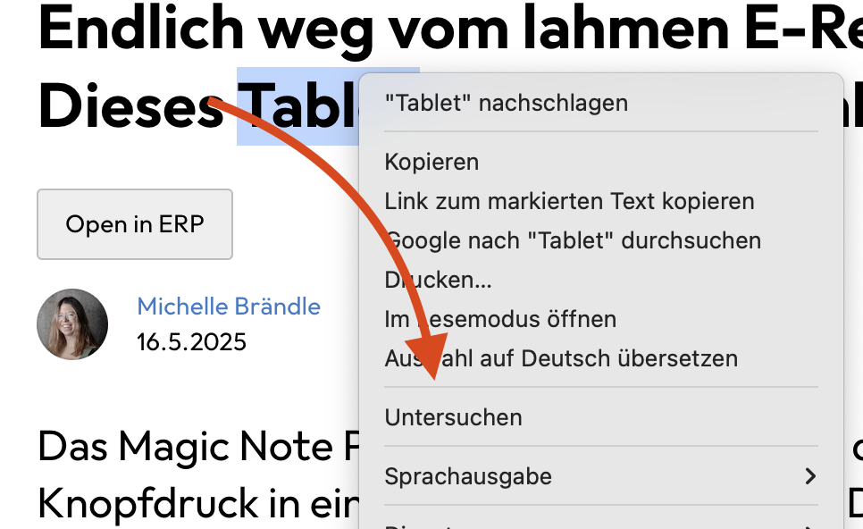
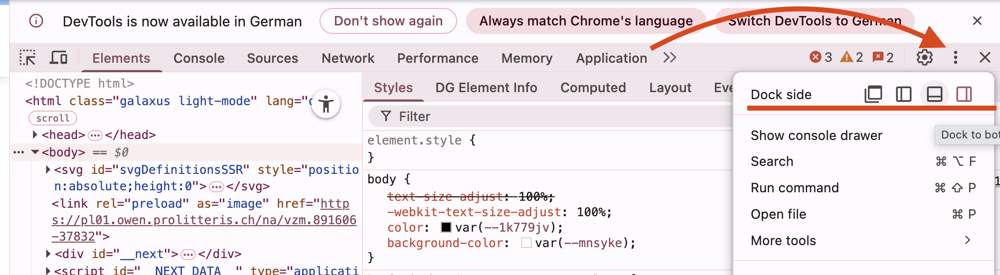
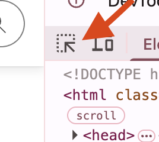
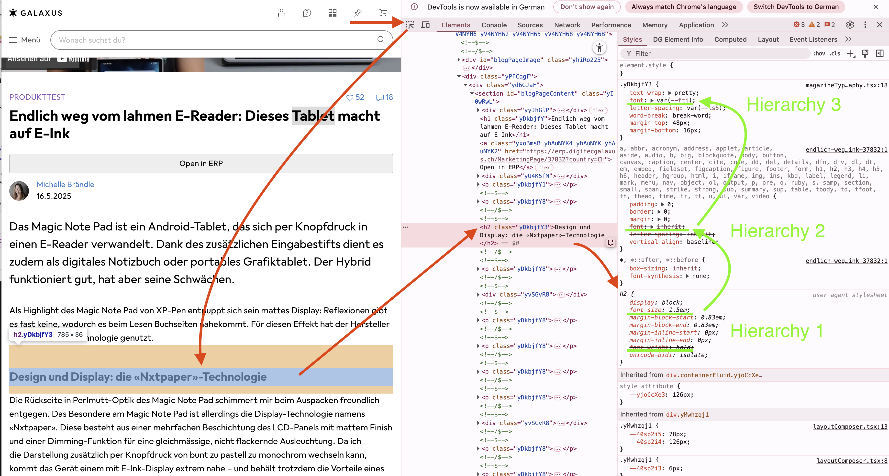

# 🎨 CSS Einstieg

## 💡 Was ist CSS?

**CSS** steht für **Cascading Style Sheets** und bildet die Grundlage des Designs für jede Webseite. 

> 🔍 **Wichtig**: Sogar wenn du kein eigenes CSS definiert hast, gibt es ein CSS! Jeder Browser definiert dies über das **"User Agent Stylesheet"**.

---

## 🔧 CSS im Browser untersuchen

### 📋 Schritt-für-Schritt-Anleitung

#### **1. Beispiel-Seite öffnen**
- **[Galaxus Artikel](https://www.galaxus.ch/de/page/endlich-weg-vom-lahmen-e-reader-dieses-tablet-macht-auf-e-ink-37832)** in **Chrome** öffnen
- **Rechtsklick** auf einen Bereich der Seite
- **"Untersuchen"** auswählen (oder **F12** drücken)



#### **2. Entwicklertools verstehen**
Das Entwickler-Werkzeug wird auf der rechten Seite angezeigt. Die Position lässt sich umschalten.



#### **3. Auswahl-Werkzeug aktivieren**
- **Auswahl-Werkzeug** in der Toolbar aktivieren
- Ermöglicht das direkte Anklicken von Elementen



#### **4. Element inspizieren**
- **Überschrift** oder anderes Element anklicken
- CSS-Eigenschaften werden rechts unter **"Styles"** angezeigt



---

## 🏗️ CSS-Hierarchie verstehen

### 📊 Kaskadierung (Cascading)

**Von unten nach oben gelesen:**

| Priorität | Quelle | Beschreibung |
|-----------|--------|--------------|
| **Niedrigste** | **User Agent Stylesheet** | Browser-Standard CSS |
| **Mittlere** | **Website CSS** | Entwickler-definierte Styles |
| **Höchste** | **Spezifische Selektoren** | Überschreibende Definitionen |

### 🔍 Was du in den DevTools siehst:

- **📋 User-Agent-Stylesheet**: Browser-Standard (unterste Ebene)
- **🎯 Hierachische Definitionen**: Von unten nach oben
- **✂️ Durchgestrichene Regeln**: "Verlierende" CSS-Definitionen
- **🏆 Gewinnende Definition**: Letzte, spezifischste Regel
- **🤖 Framework-Klassen**: Z.B. `.yDkbjfY3` (automatisch generiert)

### 💡 Beispiel-CSS-Eigenschaft
```css
margin-bottom: 16px; /* 16 Pixel Abstand unterhalb des Elements */
```

---

## 📚 CSS lernen

### 🎯 Empfohlene Lernressourcen

#### **🚀 FreeCodeCamp Tutorial**
**Link**: [Full Stack Developer Kurs](https://www.freecodecamp.org/learn/full-stack-developer/)

**Vorgehen**:
1. **CSS-Sektion** auswählen
2. **Computer Basics** überspringen (falls bereits bekannt)
3. **Responsive Web Design** für Fortgeschrittene

#### **📖 Lernweg-Struktur**
```
1. CSS Basics
   ├── Selektoren
   ├── Eigenschaften  
   └── Werte

2. Layout-Konzepte
   ├── Box Model
   ├── Flexbox
   └── CSS Grid

3. Responsive Design
   ├── Media Queries
   ├── Breakpoints
   └── Mobile First
```

---

## 🎨 Praktische Anwendung

### 🎯 Nächster Schritt: Blog-Seite stylen

Nach dem Tutorial-Durchlauf:

1. **✅ HTML-Grundgerüst** (bereits vorhanden)
2. **🎨 CSS-Design** hinzufügen
3. **📱 Responsive** machen
4. **✨ Interaktivität** erweitern

> 🔥 **Ziel**: Die Blog-Seite von einem reinen HTML-Gerüst zu einer ansprechend gestylten Webseite verwandeln!

---

## 💡 Best Practices

### ✅ CSS-Grundregeln

- **📝 Kommentare** für komplexe Bereiche
- **🏗️ Logische Struktur** in CSS-Dateien
- **🎯 Spezifische Selektoren** verwenden
- **🔄 Wiederverwendbare Klassen** erstellen

### 🔧 Browser-DevTools nutzen

- **🔍 Live-Editing** für schnelle Tests
- **📊 Computed Styles** für finale Werte
- **🎯 Element-Inspektion** für Debugging
- **📱 Device-Simulation** für Responsive Tests

---

## 🚀 Workflow-Empfehlung

### 📋 Entwicklungsschritte

1. **🖼️ Design analysieren** (Galaxus-Beispiel)
2. **🏗️ HTML-Struktur** überprüfen
3. **🎨 CSS schrittweise** hinzufügen
4. **🔄 Browser-Tests** kontinuierlich
5. **📱 Responsive** optimieren

**Bereit für kreatives CSS-Design!** 🎉
