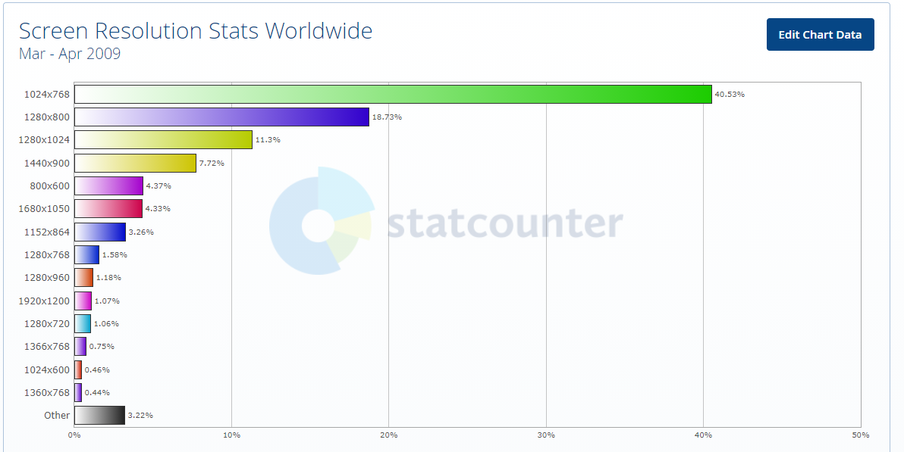
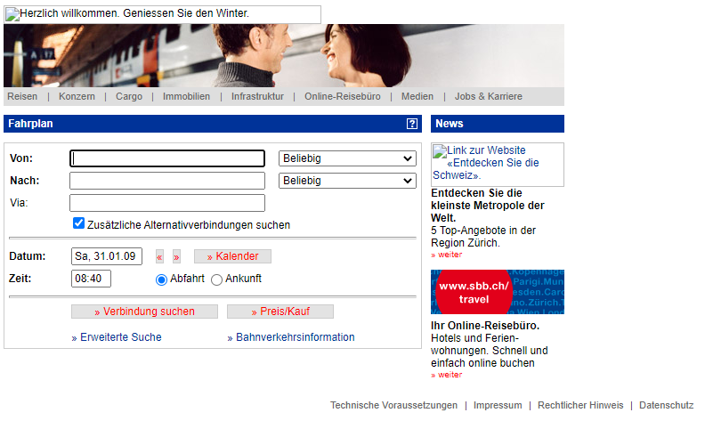
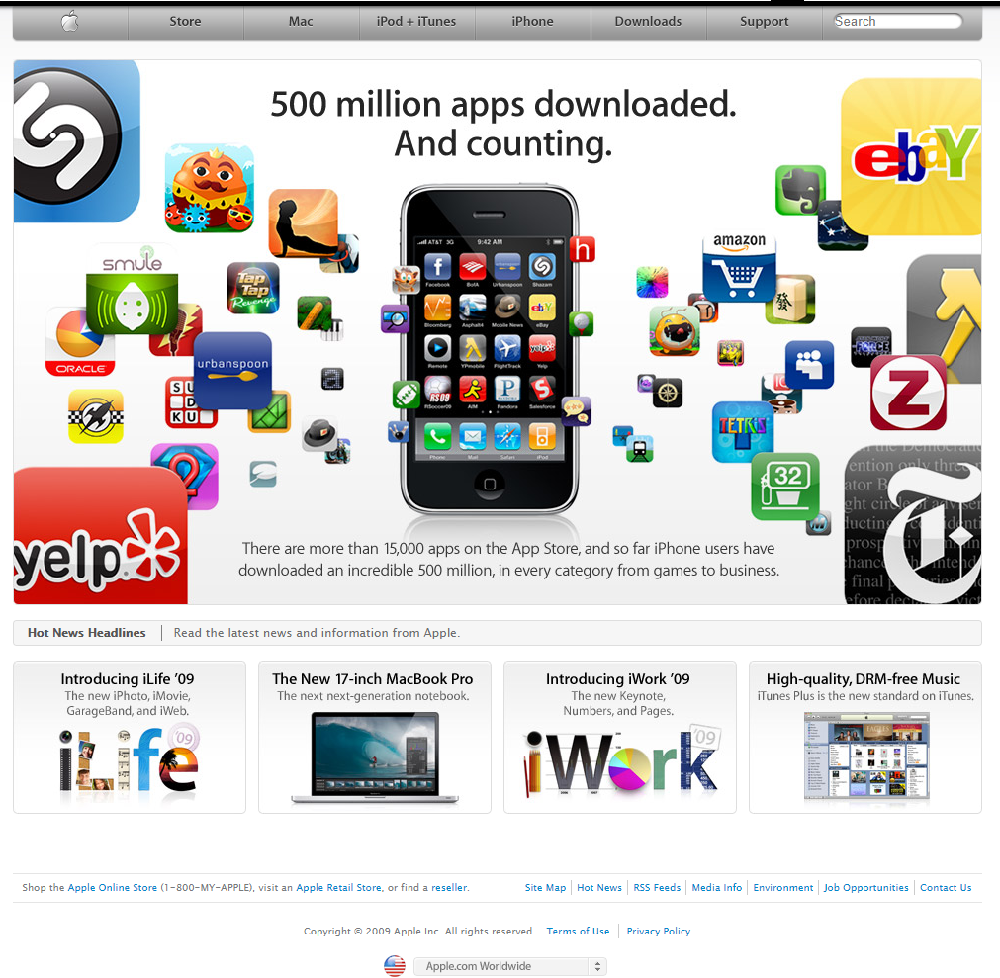
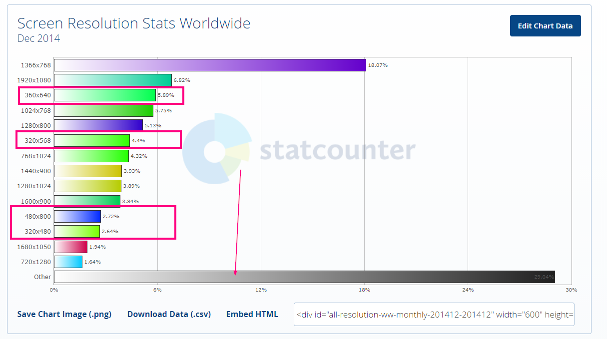
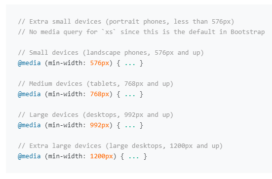
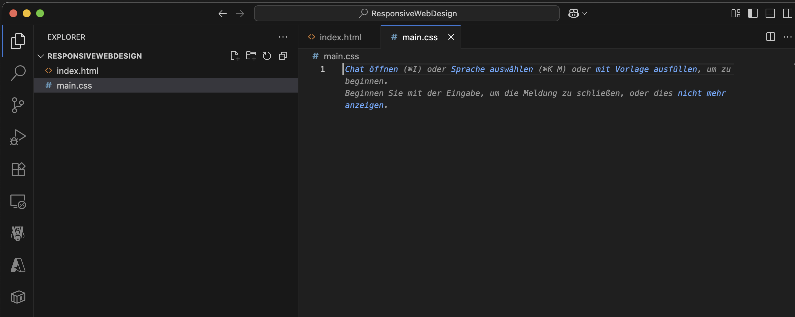
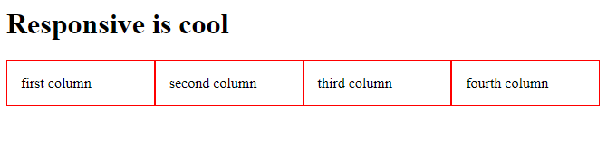
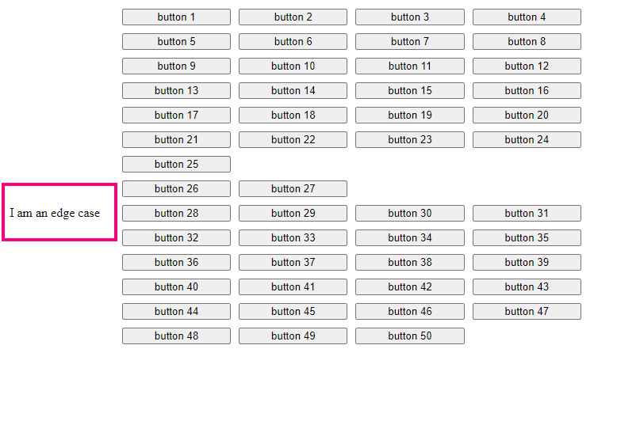
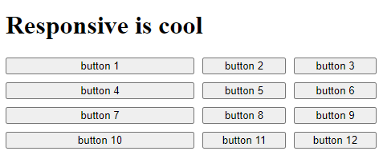

# 📱 Responsive Web Design

## 🕰️ Die Evolution des Web Designs

### 📊 2009: Die einfache Zeit

Im Jahr **2009** war noch alles viel einfacher. Die meisten User nutzten eine Bildauflösung von **1024x768 Pixel** - dem damaligen Desktop-Standard.


**Alle Auflösungen** waren im Desktop-Segment angesiedelt. Die Welt des Web-Engineers war einfach:

- **Eine Seite** für alle
- **`<table>` Tags** für Layout
- **Feste Breiten** funktionierten perfekt

SBB Seite


Apple Seite


### 📈 2014: Der Mobile Wandel



**Deutlich kleinere Auflösungen** dominieren das Chart:

- **📱 Smartphones** an der Spitze
- **"Others"** deutlich gestiegen
- **💥 Paradigmenwechsel**: Responsive Design wird Pflicht

> 🚨 **Realität**: Smartphones haben der Webentwicklung einen Dämpfer verpasst. Plötzlich müssen Seiten auch auf relativ kleinen Auflösungen gut aussehen.

---

## 📱 Mobile First & Responsive Design

### 🍎 Das iPhone-Problem (2008)

**Ursprüngliche Lösung**: Webseiten wurden "gezoomed" dargestellt

- Browser verkleinerte Desktop-Darstellung
- **Zoom-Geste** ermöglichte Navigation
- **❌ Problem**: Nicht zielführend für positive User Experience

### 🔧 Die Viewport-Lösung

**Emmet-Shortcut `!` erstellt automatisch:**

```html
<meta name="viewport" content="width=device-width, initial-scale=1" />
```

**Was passiert:**

- Browser zeigt Webseite **1:1** dar (keine Verkleinerung)
- **400px Button** = **volle Breite** auf 400px-Screen
- **Verantwortung** liegt bei der Entwicklerin

> 📖 **Mehr Infos**: [W3Schools Viewport Guide](https://www.w3schools.com/css/css_rwd_viewport.asp)

---

## 🏗️ Mobile First Strategie

### 📋 Konzept-Übersicht

**Mobile First** = Design beginnt mit kleinster Auflösung

```
📱 320px (Mobile)  →  📲 768px (Tablet)  →  🖥️ 1200px (Desktop)
```

### 🎯 Breakpoint-System

**Breakpoint** = Bestimmte Auflösung, wo sich das Design anpassen muss

**Beispiel-Szenario:**

- **Button bis 400px**: `width: 100%` ✅
- **Button ab 450px**: Anpassung nötig ❌
- **Lösung**: Breakpoint bei `400px` definieren

### 📊 Bootstrap Breakpoints (Beispiel)



**Mobile First erkennbar:**

- **Erster Breakpoint**: `min-width: 576px`
- **Bis dahin**: "Kleinster Screen" als Basis
- **Alle weiteren**: `min-width` für schrittweise Erweiterung

---

## 🛠️ Praktische Umsetzung

### 📁 Projekt-Setup

#### **Schritt 1: Ordner-Struktur**

1. **Neuen Ordner** erstellen
2. **VS Code** öffnen
3. **Files erstellen**: `index.html` + `main.css`



#### **Schritt 2: Grid-System vorbereiten**

**W3Schools Referenz**: [CSS RWD Intro](https://www.w3schools.com/css/css_rwd_intro.asp)

**12-Spalten-System** (bewährter Standard):

- **Flexible Aufteilung** für verschiedene Layouts
- **Prozentuale Breiten** für responsive Verhalten

### 📂 Grid CSS erstellen

#### **Ordner-Struktur:**

```
project/
├── index.html
├── main.css
└── styleguide/
    └── grid.css
```

#### **Grid-Klassen definieren: (grid.css)**

```css
.col-1 {
  width: 8.33%;
}
.col-2 {
  width: 16.66%;
}
.col-3 {
  width: 25%;
}
.col-4 {
  width: 33.33%;
}
.col-5 {
  width: 41.66%;
}
.col-6 {
  width: 50%;
}
.col-7 {
  width: 58.33%;
}
.col-8 {
  width: 66.66%;
}
.col-9 {
  width: 75%;
}
.col-10 {
  width: 83.33%;
}
.col-11 {
  width: 91.66%;
}
.col-12 {
  width: 100%;
}
```

### 🔧 HTML-Grundgerüst

#### **index.html Body:**

```html
<body>
  <h1>Responsive is cool</h1>
  <div class="col-3">first column</div>
  <div class="col-3">second column</div>
  <div class="col-3">third column</div>
  <div class="col-3">fourth column</div>
</body>
```

#### **Box-Sizing hinzufügen (main.css):**

```css
* {
  box-sizing: border-box;
}
```

#### **Grid-Styling erweitern (grid.css):**

```css
[class*="col-"] {
  float: left;
  padding: 15px;
  border: 1px solid red;
}
```

### 🔗 CSS verknüpfen

#### **HTML Head erweitern:**

```html
<head>
  <meta charset="UTF-8" />
  <meta name="viewport" content="width=device-width, initial-scale=1.0" />
  <title>Document</title>
  <link rel="stylesheet" href="main.css" />
</head>
```

#### **CSS Import (main.css):**

```css
@import "styleguide/grid.css";
```

Jetzt sollte deine Page wie folgt aussehen.


### 📐 Row-System implementieren

Was noch fehlt ist die Möglichkeit, einzelne Zeilen zu definieren. Wir möchten sicherstellen, dass sich die Verteilung nur auf einen bestimmten Bereich bezieht. Dafür benötigen wir noch folgende css Anweisung in unserem grid.css file

#### **Row-CSS hinzufügen (grid.css):**

```css
.row::after {
  content: "";
  clear: both;
  display: table;
}
```

#### **HTML mit Rows strukturieren:**

```html
<body>
  <h1>Responsive is cool</h1>
  <div class="row">
    <div class="col-3">first column</div>
    <div class="col-3">second column</div>
    <div class="col-3">third column</div>
    <div class="col-3">fourth column</div>
  </div>
</body>
```

Spiele nun etwas mit der Breite des Bildschirms. Du wirst nun allenfalls feststellen, dass nicht alle Breiten gut aussehen. Je Breiter der Bildschirm, desto mehr unnötige Abstände produzieren wir. Genau das wollen wir nun verbessern, indem wir im Zusammenspiel mit den MediaQueries unser Grid erst richtig erweitern.

Da wir mobile-first designen, kümmern wir uns um die Namens Zusätze erst ab dem ersten Breakpoint. Also in unserem Beispiel der Breakpoint mit dem Namen `sm` für Small

---

## 📱 Responsive Breakpoints

### 🎯 Media Queries implementieren

#### **Mobile First Basis-Grid:**

```css
/* Mobile (Standard - kein Breakpoint nötig) */
.col-1 {
  width: 8.33%;
}
.col-2 {
  width: 16.66%;
}
/* ... bis col-12 */
```

#### **Small Devices (576px+):**

```css
@media (min-width: 576px) {
  .col-sm-1 {
    width: 8.33%;
  }
  .col-sm-2 {
    width: 16.66%;
  }
  .col-sm-3 {
    width: 25%;
  }
  .col-sm-4 {
    width: 33.33%;
  }
  /* ... bis col-sm-12 */
}
```

### 💡 Responsive HTML-Beispiel

Nun hast du die Möglichkeit, das Layout für jeden Breakpoint zu definieren. Mache bspw. mal col-12 im mobile, für sm danach col-sm-3 und siehe wie sich das Layout nun verhält.

```html
<div class="row">
  <div class="col-12 col-sm-3">first column</div>
  <div class="col-12 col-sm-3">second column</div>
  <div class="col-12 col-sm-3">third column</div>
  <div class="col-12 col-sm-3">fourth column</div>
</div>
```

**Verhalten:**

- **Mobile**: 4 Zeilen (je 100% Breite)
- **ab 576px**: 4 Spalten (je 25% Breite)

---

## 🤔 Library vs. Custom Solution

Nun hast du gesehen, dass es nicht unbedingt Magie ist, ein Grid selber zu programmieren. Damit alles funktioniert, fehlen trotzdem noch einige CSS Klassen, die noch definiert werden müssen. Daher stellt sich doch gleich die Frage, wieso nicht von Anfang an Bootstrap oder andere CSS Bibliotheken einsetzen? Wenn dein Projekt keine speziellen Anforderungen hat, du mit grundsätzlich 12 Spalten problemlos dein Design umsetzen kannst, dann kannst du gut und gerne eine Bibliothek wie Bootstrap einsetzen. Trotzdem muss man sich immer bewusst sein, dass der Einsatz einer solchen Bibliothek auch erfordert, dass man sie korrekt versteht und entsprechend korrekt einsetzt. Du musst die Klassen verstehen und wissen, welche für was eingesetzt wird. Ein einfaches Beispiel mit Bootstrap sieht wie folgt aus

```html
<div class="container">
  <div class="row">
    <div class="col-sm">One of three columns</div>
    <div class="col-sm">One of three columns</div>
    <div class="col-sm">One of three columns</div>
  </div>
</div>
```

### ⚖️ Entscheidungskriterien

| Aspekt              | **Bootstrap**    | **Custom Grid**   |
| ------------------- | ---------------- | ----------------- |
| **⚡ Setup-Zeit**   | Schnell          | Länger            |
| **🎯 Flexibilität** | Begrenzt         | Vollständig       |
| **📚 Lernaufwand**  | Framework lernen | CSS verstehen     |
| **🔧 Anpassungen**  | Workarounds      | Direkte Kontrolle |
| **📦 Bundle-Size**  | Größer           | Minimal           |

### ✅ Bootstrap verwenden, wenn:

- **🚀 Schnelle Prototypen** erstellen
- **12-Spalten-System** ausreicht
- **Standard-Designs** umsetzen
- **Team** bereits Bootstrap-Erfahrung hat

### ✅ Custom Grid verwenden, wenn:

- **🎨 Unique Designs** entwickeln
- **Volle Kontrolle** benötigt
- **Performance** kritisch ist
- **Lernziele** CSS-Verständnis beinhalten

---

## 🚀 The Modern Way: CSS Grid

### 🌟 CSS Grid Vorteile (seit 2016/2017)

**Warum CSS Grid?**

- **🏗️ 2D-Layout** (Zeilen + Spalten)
- **🎯 Intuitive Syntax**
- **📱 Native Browser-Support**
- **⚡ Performance-optimiert**

### 📚 CSS Grid Lernressourcen

| Resource                                                                                  | Typ      | Beschreibung        |
| ----------------------------------------------------------------------------------------- | -------- | ------------------- |
| **[CSS Grid Garden](https://cssgridgarden.com/)**                                         | 🎮 Spiel | Interaktives Lernen |
| **[Scrimba CSS Grid](https://scrimba.com/learn-css-grid-c02k)**                           | 🎥 Video | Hands-on Kurs       |
| **[MDN Grid Guide](https://developer.mozilla.org/en-US/docs/Learn/CSS/CSS_layout/Grids)** | 📖 Docs  | Umfassende Referenz |

### 🔧 CSS Grid Implementation

#### **Variablen definieren:**

```css
:root {
  --columns-amount: 12;
  --gap-small: 20px;
}
```

#### **Grid-Container:**

```css
.row {
  display: grid;
  grid-template-columns: repeat(var(--columns-amount), 1fr);
  grid-gap: var(--gap-small);
}
```

Du wirst feststellen, dass wir bereits eine vertikale Verteilung haben. Nun möchten wir noch so was wie zuvor haben und die jeweilige Breite festlegen. Dafür müssen wir unser grid.css einfach wiederum um die breakpoints erweitern. Anstelle von breiten verwenden wir jedoch ein grid-column span.

#### **Responsive Grid-Spans:**

```css
/* Mobile */
.col-12 {
  grid-column: span 12;
}

/* Small Devices */
@media (min-width: 576px) {
  .col-sm-4 {
    grid-column: span 4;
  }
}

/* Medium Devices */
@media (min-width: 768px) {
  .col-md-3 {
    grid-column: span 3;
  }
}
```

### 🎯 Advanced CSS Grid Features

Du hast nun ein Grid ähnliches Layout mit CSS Grid als Basis gebaut. Überlege dir folgende Anforderung. Nebst dem eigentlichen Inhalt, der auf 12 Spalten verteilt ist, möchtest du nun auf einer virtuellen ersten bzw. letzten Spalte bei Bedarf einen "Seiten-Content" einfügen.


Der Rest soll sich weiterhin verteilen wie zuvor. Das Element auf der Seite soll sich an der Höhe orientieren, wo auch der entsprechende Inhalt steht. Überleg dir mal, wie du das ohne CSS Grid machen würdest.
Damit das Beispiel funktioniert, kopiere folgendes HTML in dein index.html

```html
<body>
  <h1>Responsive is cool</h1>
  <div class="row">
    <button class="col-12 col-sm-4 col-md-3">button 1</button>
    <button class="col-12 col-sm-4 col-md-3">button 2</button>
    <button class="col-12 col-sm-4 col-md-3">button 3</button>
    <button class="col-12 col-sm-4 col-md-3">button 4</button>
    <button class="col-12 col-sm-4 col-md-3">button 5</button>
    <button class="col-12 col-sm-4 col-md-3">button 6</button>
    <button class="col-12 col-sm-4 col-md-3">button 7</button>
    <button class="col-12 col-sm-4 col-md-3">button 8</button>
    <button class="col-12 col-sm-4 col-md-3">button 9</button>
    <button class="col-12 col-sm-4 col-md-3">button 10</button>
    <button class="col-12 col-sm-4 col-md-3">button 11</button>
    <button class="col-12 col-sm-4 col-md-3">button 12</button>
    <button class="col-12 col-sm-4 col-md-3">button 13</button>
    <button class="col-12 col-sm-4 col-md-3">button 14</button>
    <button class="col-12 col-sm-4 col-md-3">button 15</button>
    <button class="col-12 col-sm-4 col-md-3">button 16</button>
    <button class="col-12 col-sm-4 col-md-3">button 17</button>
    <button class="col-12 col-sm-4 col-md-3">button 18</button>
    <button class="col-12 col-sm-4 col-md-3">button 19</button>
    <button class="col-12 col-sm-4 col-md-3">button 20</button>
    <button class="col-12 col-sm-4 col-md-3">button 21</button>
    <button class="col-12 col-sm-4 col-md-3">button 22</button>
    <button class="col-12 col-sm-4 col-md-3">button 23</button>
    <button class="col-12 col-sm-4 col-md-3">button 24</button>
    <button class="col-12 col-sm-4 col-md-3">button 25</button>
    <button class="col-12 col-sm-4 col-md-3">button 26</button>
    <button class="col-12 col-sm-4 col-md-3">button 27</button>
    <button class="col-12 col-sm-4 col-md-3">button 28</button>
    <button class="col-12 col-sm-4 col-md-3">button 29</button>
    <button class="col-12 col-sm-4 col-md-3">button 30</button>
    <button class="col-12 col-sm-4 col-md-3">button 31</button>
    <button class="col-12 col-sm-4 col-md-3">button 32</button>
    <button class="col-12 col-sm-4 col-md-3">button 33</button>
    <button class="col-12 col-sm-4 col-md-3">button 34</button>
    <button class="col-12 col-sm-4 col-md-3">button 35</button>
    <button class="col-12 col-sm-4 col-md-3">button 36</button>
    <button class="col-12 col-sm-4 col-md-3">button 37</button>
    <button class="col-12 col-sm-4 col-md-3">button 38</button>
    <button class="col-12 col-sm-4 col-md-3">button 39</button>
    <button class="col-12 col-sm-4 col-md-3">button 40</button>
    <button class="col-12 col-sm-4 col-md-3">button 41</button>
    <button class="col-12 col-sm-4 col-md-3">button 42</button>
    <button class="col-12 col-sm-4 col-md-3">button 43</button>
    <button class="col-12 col-sm-4 col-md-3">button 44</button>
    <button class="col-12 col-sm-4 col-md-3">button 45</button>
    <button class="col-12 col-sm-4 col-md-3">button 46</button>
    <button class="col-12 col-sm-4 col-md-3">button 47</button>
    <button class="col-12 col-sm-4 col-md-3">button 48</button>
    <button class="col-12 col-sm-4 col-md-3">button 49</button>
    <button class="col-12 col-sm-4 col-md-3">button 50</button>
  </div>
</body>
```

#### **Erweiterte Spalten:**

Damit wir unser .aside links bzw. rechts hinzufügen können, müssen wir als erstes dem ganzen Inhalt weitere Spalten hinzufügen. Das einfachste ist, unserer "row" Klasse diese Spalten hinzuzufügen. Dies machen wir nun im grid.css und passen einfach unsere grid-template-columns definition der .row klasse an.

```css
.row {
  display: grid;
  grid-template-columns: 150px repeat(var(--columns-amount), 1fr) 150px;
  grid-gap: var(--gap-small);
}
```

Nun wird die Page etwa so aussehen:


Wir haben also erreicht, dass wir unseren Inhalt neu auf 14 Spalten verteilen. Was wir aber nicht möchten, ist, dass die erste Spalte durch Inhalt belegt wird. Wir möchten alles eines nach "rechts" verschieben. Wie erreichen wir das rein nur über CSS? Wir wollen keine Klasse im HTML anpassen müssen.

#### **grid-span:**

Damit wir das Ziel erreichen, können wir unser CSS mit folgendem Attribut erweitern:

```css
.col-12 {
  grid-column: 2 / span 12;
}
```

Teste die entsprechende Auflösung. Sieht es gut aus? Das ganze benötigen wir nun auch für unsere anderen Auflösungen. Benutze Media Queries und erweitere die col-x Klassen entsprechend. Wir verzichten auf alle col-definitionen, da wir nur entweder 12 spalten, 4 oder 3 brauchen (`col-12`, `col-sm-4`, `col-md-3`).

```css
/* Mobile-Spaltenklassen */
col-12 {
  grid-column: 2 / span 12;
}

/* Spaltenklassen für Breakpoint 576px (sm) */
@media (min-width: 576px) {
  .col-sm-4 {
    grid-column: 2 / span 4;
  }
}

/* Spaltenklassen für Breakpoint 768px (md) */
@media (min-width: 768px) {
  .col-md-3 {
    grid-column: 2 / span 3;
  }
}
```

Teste ein wenig das neue Layout. Folgende Dinge sollten dir auffallen:

- Je nach Grösse des Bildschirms haben wir einen etwas zu grossen gap
- Je nach Grösse des Bildschirms sind die zusätzlichen Spalten am Anfang und Ende zu breit
- Die Höhe der Elemente ist teilweise unterschiedlich
- Die Elemente sind nun immer ab der zweiten Spalte gereiht und nicht mehr verteilt
  Alle dies Dinge wollen wir nun beheben. Die einfachste ist auf jeden Fall das Gap und die Spaltenbreite.

Passe daher dein css entsprechend an. Wir setzen Variablen ein, die wiederum mit Media-Queries definiert werden. So können wir die Angaben automatisch setzen, basierend auf der Viewport Grösse. Genius 🤓

```css
:root {
  --columns-amount: 12;
  --column-width: 50px;
  --gap-width: 20px;

  @media (min-width: 768px) {
    --column-width: 150px;
    --gap-width: 40px;
  }
}

.row {
  display: grid;
  grid-template-columns: var(--column-width) repeat(
      var(--columns-amount),
      1fr
    ) var(--column-width);
  grid-gap: var(--gap-width);
}
```

#### **Gleiche Höhen:**

Für das Problem mit der Höhe der Elemente bietet uns CSS Grid eine sehr einfach Eigenschaft an. Mit "grid-auto-rows" und dem Wert "1fr" weisen wir das Grid an, jeweils die selbe Höhe einzusetzen. Basierend auf der Mindest-Höhe, welches ein Element einnimmt. Du kannst beispielsweise bei einem Button den Text so lange machen, dass er noch höher wird. Achte dann darauf, was geschieht. Dafür erweitere einfach das css ganz am Anfang um den entsprechenden Wert.

```css
.row {
  display: grid;
  grid-auto-rows: 1fr; /* Alle Elemente gleiche Höhe */
  grid-template-columns: var(--column-width) repeat(
      var(--columns-amount),
      1fr
    ) var(--column-width);
  grid-gap: var(--gap-small);
}
```

Das etwas mühsamere Problem ist, dass wir nun unsere Elemente verteilen möchten, sobald die Breite der Elemente weniger als 12 Spalten einnimmt. Daher für unsere `col-sm-4` sowie `col-md-3` Klassen benötigen wir eine bessere Lösung.

Wenn wir weiterhin von unserem 12er Grid ausgehen, müssen wir das CSS Grid immer nur für das 4te bzw. 3te Element anweisen, auf die erste Stelle zu springen. Dafür hat CSS den sehr schönen nth-child Selector. Mit diesem können wir genau unser CSS entsprechend erweitern. Passe nun also unsere bisherigen `.col-sm-4` bzw. `.col-md-3` Klassen so an.

#### **nth-child selector:**


```css
  .col-sm-4:nth-child(3n+1) {
    grid-column: 2 / span 4;
  }

  .col-md-3:nth-child(4n+1) {
    grid-column: 2 / span 3;
  }
```

Wenn du es testet, sieht es irgendwie noch nicht so ganz toll aus. Weisst du wieso? Das Problem liegt leider genau wieder bei unserem neuen Selektor. Das nth-child von bspw. col-sm-4 wird auch bei einer Auflösung von mehr als unserem md-breakpoint appliziert. Wir haben sie also dreifach (`col-12`, `col-sm-4`, `col-m-3`). Wie beheben wir nun das Problem?

Es gibt zwei Varianten. Wir erweitern unsere Media-Queries, dass sie nicht nur ein Min-Width sondern auch ein Max-Width berücksichtigen. Dies hat den Nachteil, dass wir bei Anpassungen nach "oben" zusätzliche Schritte implementieren müssen. Der andere Ansatz ist, dass wir ganz den Mobile First Ansatz verfolgen und von klein nach gross dafür sorgen müssen, dass die CSS Angaben wichtiger sind als die vorherigen. Wir definieren also nicht nur unsere nth-child Elemente die rutschen sollen, sondern auch noch alle die bleiben sollen. Zusätzlich müssen wir auch dafür ein nth-child Selektor einsetzen, damit er als wichtiger betrachtet wird und die anderen Anweisungen überschreibt. Unser css sieht dann wie folgt aus:

```css
/* ... von col-sm-1 */
  .col-sm-4:nth-child(1n + 1) {
    grid-column: span 4;
  }
  .col-sm-4:nth-child(3n + 1) {
    grid-column: 2 / span 4;
  }
  …
  .col-md-3:nth-child(1n + 1) {
    grid-column: span 3;
  }
  .col-md-3:nth-child(4n + 1) {
    grid-column: 2 / span 3;
  }
/* ... bis col-md-12 */
```

#### **Sidebar Implementation:**
Erweitere dein HTML innerhalb der .row. Wo genau, spielt keine Rolle. Vergib die Klasse .aside

```html
<div class="aside">I am an edge case</div>
```
Wie können wir nun das Element auf die Seite stellen? Einfacher als das. Mit unserem grid-column aus dem css grid haben wir nun die freie Möglichkeit, mit column und row zu definieren, wohin das Element soll.
Füge im "grid.css" einfach folgende Klasse hinzu.

```css
.aside {
  grid-column: 1
}
```
Sieht toll aus, oder? Du kannst etwas mit der Position spielen, span hinzufügen und/oder auch die Position definieren. Ein Beispiel dafür könnte wie folgt aussehen.

```css
.aside {
  grid-column: 1;
  grid-row: span 13;
  place-self: center;
}
```

---

## 🔄 CSS Flexbox
Die bisherigen Layout Möglichkeiten beziehen sich sowohl auf die horizontale wie auch auf die vertikale Verteilung von Elementen. Man kann es sich auch so vorstellen, dass man damit sehr gut fährt, wenn man das eigentlich Design-Layout umsetzen möchte. Also wo gibt es auf der Seite Inhalt? Gibt es eine Navbar? Gibt es einen Side-Content? Gibt es einen Footer?
Mit CSS Grid, Bootstrap oder Spalten Design lassen sich diese Art von Design / Layouts sehr gut strukturieren und umsetzen. Man könnte auch von 2 Dimensionalen Layouts sprechen. Nebst diesen Varianten hält seit einigen Jahren auch Flexbox Einzug im ganzen CSS Universum. Analog CSS Grid kennt der Browser CSS Flexbox direkt und wird unterdessen breit von den Browser unterstützt. Flexbox ist sogar älter als CSS Grid. Bei Flexbox sprechen wir nun eher von einem eindimensionalen Design. Wir können damit sehr gut Elemente auf der selben Ebene layouten. Sei dies auf der vertikalen oder horizontalen Ausrichtung.


### 🎯 Flexbox vs. Grid

| Feature            | **CSS Grid**          | **CSS Flexbox**    |
| ------------------ | --------------------- | ------------------ |
| **📐 Dimensionen** | 2D (Zeilen + Spalten) | 1D (Eine Richtung) |
| **🎯 Use Case**    | Page Layout           | Component Layout   |
| **📱 Responsive**  | Breakpoint-basiert    | Content-basiert    |
| **🔧 Komplexität** | Höher                 | Einfacher          |

### 📚 Flexbox Lernressourcen

- **[Flexbox Froggy](https://flexboxfroggy.com/)** 🐸
- **[CSS-Tricks Flexbox Guide](https://css-tricks.com/snippets/css/a-guide-to-flexbox/)** 📖

---

## 🎯 Technologie-Entscheidung

### 🤔 Die richtige Wahl treffen

#### **Fragen zur Orientierung:**

1. **🆕 Neues Projekt** oder bestehende Libraries?
2. **👥 Team-Erfahrung** mit welcher Technologie?
3. **🎨 Layout-Flexibilität**: Immer 12 Spalten oder variabel?
4. **📱 Device-Support**: Welche Breakpoints nötig?

#### **💡 Empfehlungen:**

| Szenario                         | Empfehlung             | Begründung                   |
| -------------------------------- | ---------------------- | ---------------------------- |
| **🚀 Neue Website**              | **CSS Grid + Flexbox** | Modern, flexibel, performant |
| **🔧 Bestehende Bootstrap-Site** | **Bootstrap**          | Konsistenz wahren            |
| **🎯 Einfache Layouts**          | **Flexbox**            | Weniger Overhead             |
| **🏗️ Komplexe Layouts**          | **CSS Grid**           | 2D-Kontrolle                 |

### ⚠️ Anti-Patterns vermeiden

- **❌ Bootstrap + CSS Grid Mix** (Konflikte)
- **❌ Float-basierte Layouts** (veraltet)
- **❌ Table-Layout für Design** (nicht semantisch)

---

## 🎉 Zusammenfassung

### ✅ Was du gelernt hast:

1. **📱 Mobile First Prinzip**
2. **🔧 Custom Grid System**
3. **📊 Breakpoint-Strategien**
4. **🚀 CSS Grid Modernisierung**
5. **⚖️ Technologie-Entscheidungen**

### 🎯 Nächste Schritte:

1. **💻 Praktisches Üben** mit eigenem Projekt
2. **🎮 CSS Grid Garden** durchspielen
3. **🐸 Flexbox Froggy** meistern
4. **🏗️ Blog-Seite** responsive machen

**Du bist bereit für modernes, responsives Webdesign!** 🌟