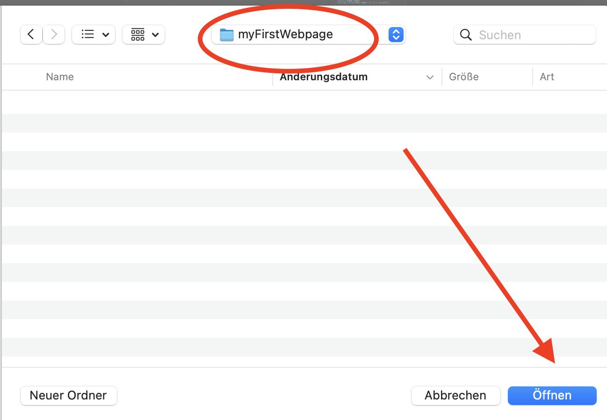
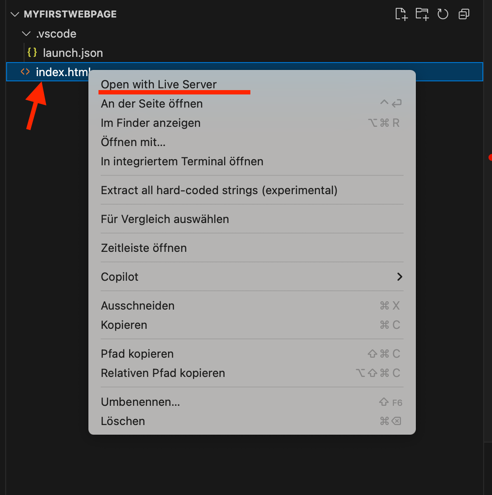
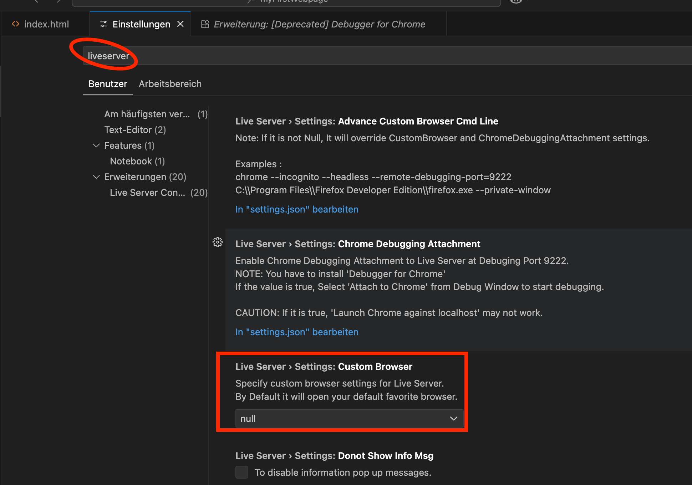

# 🌐 HTML Einstieg

## Grundlagen lernen

Am einfachsten lernst du die HTML-Grundlagen im **Tutorial-Kurs** von [FreeCodeCamp](https://www.freecodecamp.org/learn/full-stack-developer/). Mit dem Abschluss des HTML-Teils solltest du die wichtigsten Tags kennen, die wir auch in unserem Beispiel nutzen werden.

---

## Erste HTML-Seite erstellen

### Schritt 1: Projekt-Setup

1. **Visual Studio Code öffnen**
2. **"Ordner öffnen" wählen**



3. **Passenden Ordner anlegen** (z.B. "myFirstWebpage")
4. **Öffnen des Ordners bestätigen**

### Schritt 2: HTML-Datei erstellen

1. **Neues File anlegen**: `index.html`
2. **Emmet-Abkürzung verwenden**: 
   - Schreibe `!` gefolgt von `TAB`
   - Dies führt die [Emmet Abbreviation](https://docs.emmet.io/abbreviations/) aus

3. **Grundgerüst sollte automatisch erstellt werden**:

```html
<!DOCTYPE html>
<html lang="en">
<head>
    <meta charset="UTF-8">
    <meta name="viewport" content="width=device-width, initial-scale=1.0">
    <title>Document</title>
</head>
<body>
    
</body>
</html>
```

### Schritt 3: LiveServer starten

1. **Rechtsklick auf `index.html`**
2. **"Open with LiveServer" wählen**



> 💡 **Hinweis**: Falls der Button nicht verfügbar ist, überprüfe dein Setup und installiere die LiveServer Extension (siehe Abschnitt "Setup")

### Schritt 4: Browser-Ansicht

- **Automatisches Öffnen** im Browser-Fenster
- **Standard-Port**: 5500
- **Live-Reload**: Änderungen werden sofort angezeigt

---

## LiveServer konfigurieren

### Custom Browser einstellen

1. **Einstellungen öffnen**
2. **Nach "liveserver" suchen**
3. **Custom Browser einstellen**



### Erweiterte Konfiguration

Für weitere Einstellungen kannst du alles in der `settings.json` bearbeiten:

```json
{
  "liveServer.settings.port": 5500,
  "liveServer.settings.CustomBrowser": "chrome",
  "liveServer.settings.donotShowInfoMsg": true
}
```

---

## Nächste Schritte

Nach dem erfolgreichen Setup kannst du mit dem [Blog Page](blogpage.md) Tutorial fortfahren und deine erste komplette Webseite erstellen!

### ✅ Was du jetzt kannst:

- **HTML-Grundgerüst** erstellen
- **LiveServer** verwenden
- **Live-Reload** für Entwicklung nutzen
- **VS Code** für Web-Entwicklung konfigurieren