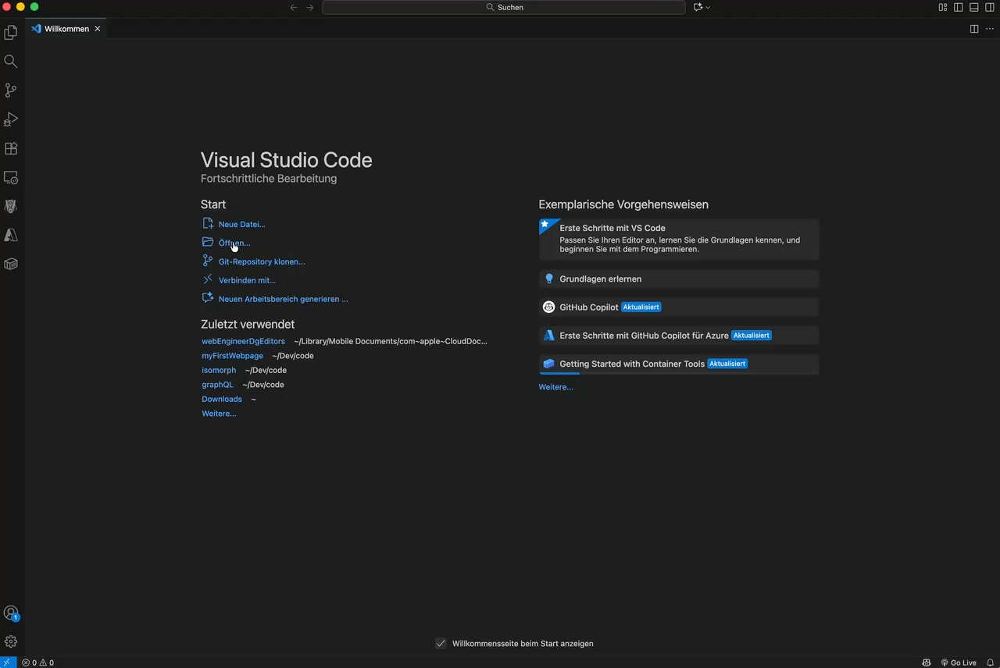

# Basics
Damit du den Einstieg in die JavaScript findest, solltest du die Grundlagen verstehen. Wie in jeder Programmiersprache sind dies die üblich verdächtigen wie Variablen, Funktionen, Schleifen etc. JavaScript ist da auch nicht viel anders.

Einerseits findest du auf W3Schools verschiedene Tutorials dazu [W3Schools JavaScript](https://www.w3schools.com/js/default.asp) und anderseits im GitHub verschiedene Übungen, die du auf deinen Gerät direkt programmieren und ausprobieren kannst.

## GitHub Übungen
- gehe auf [Github Repo](https://github.com/rekoch/webEngineerDgEditors/) und lade den Code per ZIP File herunter

- entpacke das ZIP lokal
- öffne den folder [/public/03_javascript/01_basics](https://github.com/rekoch/webEngineerDgEditors/tree/main/public/03_javascript/01_basics) direkt im Vs Code

- nun kannst du jedes File Schritt für Schritt in deinem Tempo durchgehen. Es gibt bei den meisten ein Excercise dazu, wo das zuvor gelernte üben kannst
- Starte die "Erklär" Files am Besten lokal auf deinem Gerät mit der Vs Code Debug Funktion. So kannst du durchgehen und siehst auch immer die Ausgabe in der Konsole

- wenn du danach die übungen machst, überprüfe sie indem du mit dem Debugger durchgehst oder mittels dem Befehl `node` gefolgt vom Dateinamen die Datei ausführst.
```bash
node 02_variables_excercises.js
```