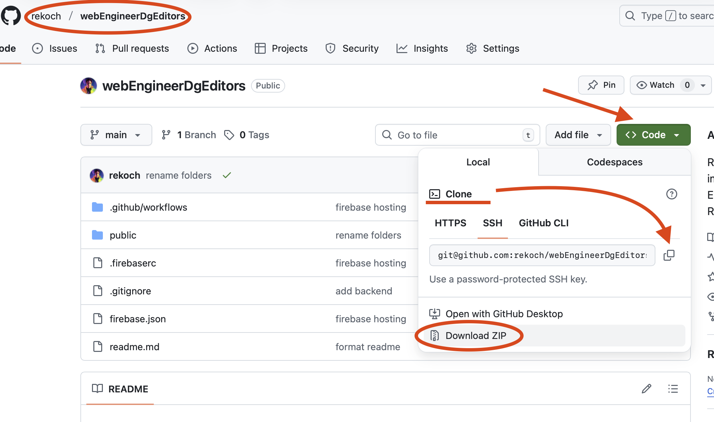
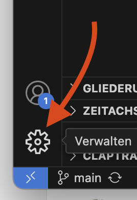
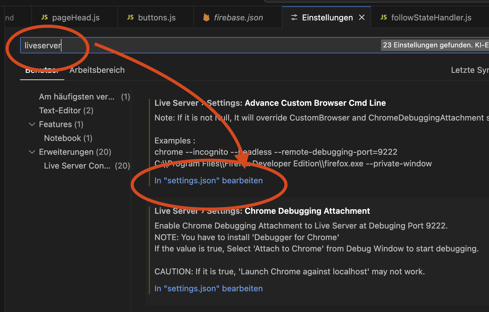
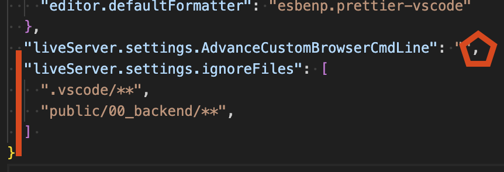
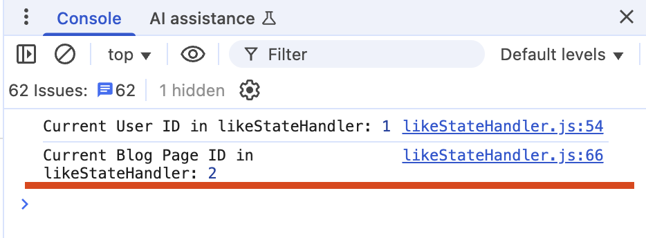

# ⛓️‍💥 Backend verbinden

## 🎯 Frontend trifft Backend

### 📊 Situation verstehen

**Frontend-Only**: Alles ist einfach - nur **ein Datenzustand** im Browser:
- Button gedrückt? ✅ HTML/Cookie
- Seite geliked? ✅ Lokaler Speicher

**Mit Backend**: **Zwei Datenzustände** synchronisieren:
- 🖥️ **Frontend-State** (Browser)
- 🗄️ **Backend-State** (Datenbank)

### 🎯 Erste Implementierung-Ziele

1. **📊 Like Count** vom Backend laden und korrekt anzeigen
2. **🔄 Blog-Page-ID-Wechsel** mit Backend-Daten synchronisieren

---

## 📁 Code-Setup

### 🔗 Projekt-Code holen

**Frontend herunterladen:**
```
https://github.com/rekoch/webEngineerDgEditors/tree/main/public/03_javascript/04_01_backendBaseConnection
```

**Backend herunterladen:**
```
https://github.com/rekoch/webEngineerDgEditors/tree/main/public/00_backend
```

**Alternative:** Komplettes [GitHub Projekt klonen](https://github.com/rekoch/webEngineerDgEditors) oder als ZIP herunterladen.


### ⚙️ VS Code Settings anpassen

**LiveServer-Konfiguration erweitern:**

1. **Settings öffnen**: Button unten links → Settings



2. **LiveServer suchen**: "liveServer" eingeben → "In settings.json öffnen"


3. **JSON erweitern**:

```json
"liveServer.settings.ignoreFiles": [
  ".vscode/**",
  "public/00_backend/**"
]
```
Achte darauf, dass bei der Zeile davor ein Komma am Schluss ist.


4. **Speichern** und schließen

### 🔧 Optional: SQLite-Editor

[SQLite3 Editor Extension](https://marketplace.visualstudio.com/items?itemName=yy0931.vscode-sqlite3-editor) installieren für direkten Datenbank-Zugriff.

---

## 📂 Projekt-Struktur verstehen

### 🗄️ Backend-Struktur (`00_backend/`)

```
00_backend/
├── 📄 app.js                    # Express-Hauptanwendung
├── 📄 package.json              # Dependencies & Scripts
├── 📄 .env                      # Umgebungsvariablen
├── 📄 editorialContent.db       # SQLite-Datenbank
├── 📄 readme.md                 # Setup-Anweisungen
├── 📁 routes/                   # API-Endpunkte
│   ├── likes.js                 # Like-Funktionalität
│   ├── authorFollow.js          # Autor-Follow
│   └── topicFollow.js           # Topic-Follow
├── 📁 db/                       # Datenbank-Layer
│   ├── blogPageLikesRepo.js     # Like-Operationen
│   ├── authorFollowRepo.js      # Autor-Follow-Ops
│   └── topicFollowRepo.js       # Topic-Follow-Ops
└── 📁 utils/                    # Middleware & Tools
    ├── corsMiddleware.js        # CORS-Konfiguration
    └── swagger.js               # API-Dokumentation
```

### 🚀 Backend starten

```bash
# Terminal öffnen
cd public/00_backend

# Dependencies installieren  
npm install

# Development-Server starten
npm run dev

# ✅ Backend läuft auf Port 3000
# 📚 API-Docs: http://localhost:3000/api-docs/
```

### 🎨 Frontend-Struktur (`04_01_backendBaseConnection/`)

```
04_01_backendBaseConnection/
├── 📄 index.html                # Haupt-HTML
├── 📁 css/                      # Styling
├── 📁 javascript/
│   ├── 📄 main.js               # Entry Point
│   ├── 📁 services/             # Backend-Services
│   │   ├── 📄 observer.js       # Event-System (Singleton)
│   │   ├── 📄 httpClient.js     # HTTP-Wrapper
│   │   ├── 📄 blogPageLikes.js  # Like-API-Calls
│   │   ├── 📄 authorFollow.js   # Autor-Follow-APIs
│   │   └── 📄 topicFollow.js    # Topic-Follow-APIs
│   └── 📁 pages/blogPage/       # Blog-spezifische Logik
│       ├── 📄 blogPageMain.js   # Koordination
│       ├── 📄 buttons.js        # Button-Events
│       ├── 📄 likeStateHandler.js    # Like-State
│       ├── 📄 followStateHandler.js  # Follow-State
│       └── 📄 tables.js         # Tabellen-Management
```

### 🏗️ Architektur-Highlights

#### **Services Layer**
- **Backend-Integration**: Alle API-Calls (erfordert laufenden Backend-Server)
- **Observer Pattern**: Event-System für applikationsweite Zustandssynchronisation
- **Vorteil**: Keine Page-Reloads bei Datenänderungen

#### **Event-Driven Architecture**
- **Observer.js**: Singleton-Pattern für typsafe Events
- **Auto UI-Updates**: Änderungen reflektiert überall
- **Performance**: Minimale API-Calls durch intelligente Zustandsverwaltung

#### **Moderne JavaScript-Patterns**
- **ES6-Module**: Import/Export-System
- **Async/Await**: Statt Promise-Chains
- **Event Prevention**: Verhindert Page-Reloads

### 🔄 Frontend ↔ Backend Workflow

1. **Frontend** → API-Calls über Services
2. **Backend** → JSON-Response  
3. **Observer** → Änderungen an UI-Komponenten verteilen
4. **UI** → Automatische Updates ohne Page-Reload

---

## 📊 Like Count Implementation

### 🎯 Schritt 1: setLikeCounter-Funktion erstellen

**In `likeStateHandler.js` - am Ende der Datei:**

```javascript
function setLikeCounter() {
  // Logik kommt hier rein
}
```

### 🔒 Schritt 2: BlogPageId-Validierung

```javascript
function setLikeCounter() {
  if (blogPageId) {
    // Nur weiter wenn gültige BlogPageId vorhanden
  }
}
```

### 🎨 Schritt 3: HTML-Element finden und Test-Wert setzen

```javascript
function setLikeCounter() {
  if (blogPageId) {
    document.getElementById("data-like-counter").textContent = 99;
  }
}
```

### 🔗 Schritt 4: Funktion integrieren

**`blogPageMain.js` erweitern:**
```javascript
// Importiere die notwendigen Module
import "./buttons.js";
import "./tables.js";
import "./likeStateHandler.js";
```

**`likeStateHandler.js` - am Ende:**
```javascript
observeUserIdChange();
observeBlogPageIdChange();
observeLikeEvents();
setLikeCounter();
```

### ⚡ Schritt 5: BlogPageId setzen & Sichtbarkeit

**Test-BlogPageId setzen:**
```javascript
let blogPageId = 37832;  // Statt 0
```

**Invisible-Klasse entfernen:**
```javascript
function setLikeCounter() {
  if (blogPageId) {
    document.getElementById("data-like-counter").textContent = 99;
    document.getElementById("like-counter").classList.remove("invisible");
  }
}
```

**✅ Test**: Du solltest jetzt "99" und den Text sehen!

---

## 🌐 Backend-Integration

### 📡 Schritt 1: Service importieren

```javascript
import { appObserver, ObserverEvents } from "../../services/observer.js";
import { getLikesPerBlogPage } from "../../services/blogPageLikes.js";
```

### 🔄 Schritt 2: Backend-Call implementieren

```javascript
function setLikeCounter() {
  if (blogPageId) {
    try {
      const response = getLikesPerBlogPage(blogPageId);
      document.getElementById("data-like-counter").textContent = response.likeCount;
      document.getElementById("like-counter").classList.remove("invisible");
    } catch (error) {
      console.error("Error loading likes:", error);
    }
  }
}
```

**🚨 Problem**: Keine Zahl wird angezeigt? **Async-Problem!**

### ⚡ Schritt 3: Async/Await Pattern

**Problem**: Code wartet nicht auf Backend-Response.  
**Lösung**: `await` für asynchrone Operationen.

```javascript
async function setLikeCounter() {
  if (blogPageId) {
    try {
      const response = await getLikesPerBlogPage(blogPageId);
      document.getElementById("data-like-counter").textContent = response.likeCount;
      document.getElementById("like-counter").classList.remove("invisible");
    } catch (error) {
      console.error("Error loading likes:", error);
    }
  }
}
```

**✅ Test**: Echte Backend-Daten werden geladen!

---

## 🔄 Event-Driven Counter Updates

### 🎯 BlogPageId-Change-Event nutzen

**Direkten Funktionsaufruf entfernen:**
```javascript
// observeUserIdChange();
// observeBlogPageIdChange();
// observeLikeEvents();
// setLikeCounter(); ← Diese Zeile entfernen
```

### 📡 Observer-Integration

**In `observeBlogPageIdChange()`:**
```javascript
function observeBlogPageIdChange() {
  appObserver.subscribe(
    ObserverEvents.BLOG_PAGE_ID_CHANGED,
    async (data) => {
      blogPageId = data.blogPageId;
      console.log("Current Blog Page ID in likeStateHandler:", blogPageId);
      
      setLikeCounter(); // ← Hier aufrufen
    },
    true  // Replay-Funktion für Initial-State
  );
}
```

### 🔄 Event-Flow verstehen

1. **`main.js`** → BlogPageId = 2 setzen
2. **`main.js`** → `appObserver.emit()` Event versenden
3. **Observer** → Alle Subscriber informieren
4. **`likeStateHandler`** → `subscribe()` mit `true` = Replay-Funktion
5. **Replay** → Auch nachträglich registrierte Subscriber erhalten letzten Wert

### 🔄 BlogPageId zurücksetzen

```javascript
let blogPageId = 0;  // Wieder auf 0, da Wert von Observer kommt
```

**✅ Test**: Likes werden weiterhin geladen, aber jetzt event-driven!

Du kannst dies auch im Console.log überprüfen.


---

## 🧪 Testing & Experimentation

### 🔧 BlogPageId dynamisch ändern

**In `main.js` experimentieren:**
```javascript
// Verschiedene Blog-Page-IDs testen
appObserver.emit(ObserverEvents.BLOG_PAGE_ID_CHANGED, { blogPageId: 12345 });
```

### 📊 Development Workflow

1. **Backend starten**: `cd 00_backend && npm run dev`
2. **Frontend öffnen**: `index.html` über LiveServer
3. **API testen**: http://localhost:3000/api-docs/
4. **Console-Logs beobachten** für Event-Flow-Debugging

---

## 🎉 Meilenstein erreicht!

### ✅ Was funktioniert jetzt:

1. **📊 Backend-Integration** - Like-Count aus Datenbank
2. **🔄 Event-Driven Updates** - Observer-Pattern implementiert
3. **⚡ Async/Await** - Moderne JavaScript-Patterns
4. **🎛️ Dynamic BlogPageId** - Reaktion auf ID-Änderungen

### 🚀 Nächste Schritte:

Im nächsten Kapitel machen wir die **Like-Buttons funktional** und synchronisieren Backend-State mit Frontend-Interaktionen!