# Debug JS mit Chrome
Die Methode welche den einfachsten Zugang gewährt, ist der Browser selbst. Denn der Browser führt direkt JavaScript aus und unterstützt dich mit vielen sinnvollen Tools.

1. Öffne die Seite [02_buttonReactive](https://web-eng-dg.web.app/03_javascript/03_buttonReactive/index.html) mit Chrome
1. Öffne die Dev Tools (F12, rechtsklick im HTML -> untersuchen)
1. Scrolle zu den Buttons am Ende der Seite
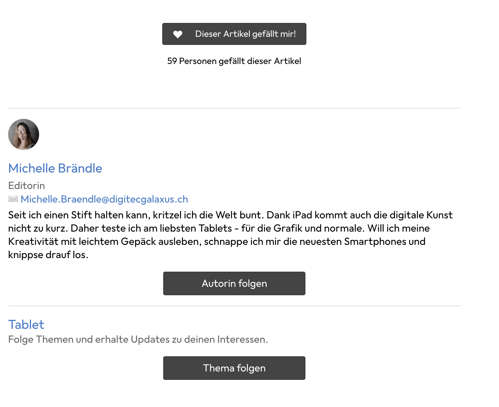
1. Drücke bspw. auf den "Dieser Artikel gefällt mir!" Button. Du siehst, dass sich die Anzeige ändert und bspw. von "59 auf 60" bzw. zurück auf "59" wechselt
1. Damit wir den dahinter liegenden JavaScript Code debuggen können, müsstest du schon fast wissen wie der heisst. Du kannst auch auf gut Glück die Dateien betrachten.
1. Wähle im Dev-Tool das Tab "sources"
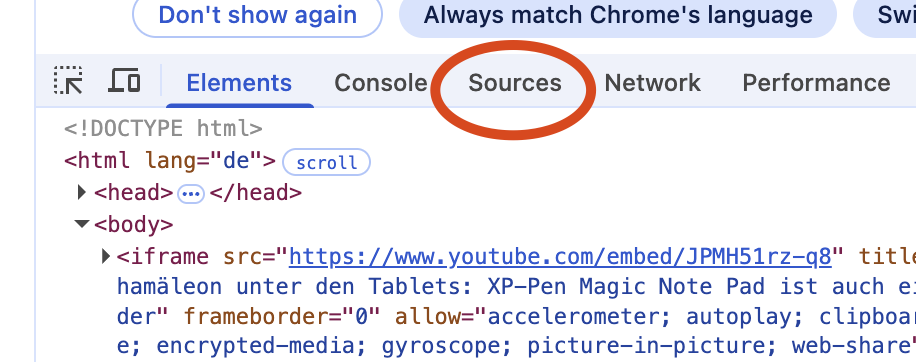
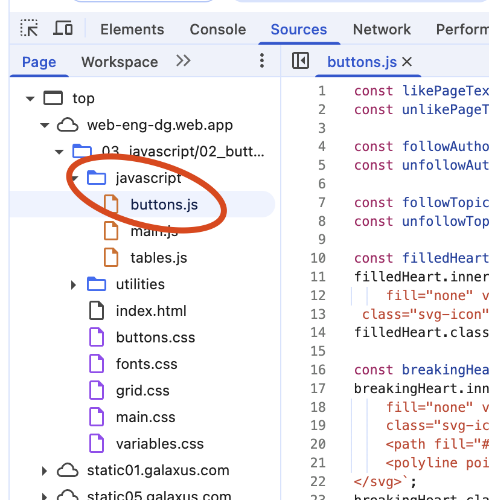
1. In diesem Fall haben wir "Glück" und es gibt den Folder "javascript" und die Datei "buttons.js" umd die es wohl geht. Klicke die Datei an. Der Source-Code wird auf der rechten Seite angezeigt
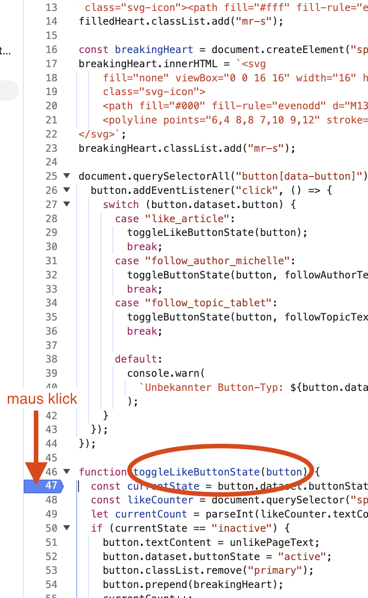
1. Wenn du weiter schaust findest du die Funktion `toggleLikeButtonState` was wohl unser gesuchtes Stück Code sein dürfte. Klicke danach links beim Zeilenmarker mit der Maus. Du solltest eine Markierung kriegen.
1. Drücke jetzt nochmals auf den like button. Wenn es geklappt hat, siehst du im Dev Tool nun die Stelle umrandet. Zudem etwas weiter rechts noch die ganzen debug tools. Auf der Seite selbst steht ebenfalls eine Info.
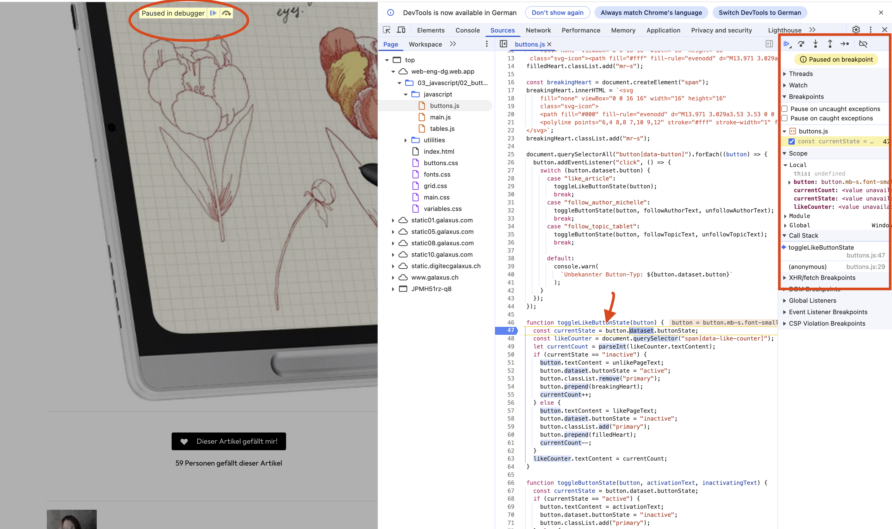
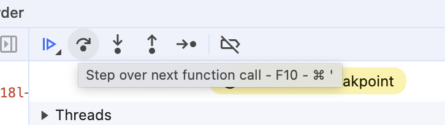
1. Mit F10 oder dem button kannst du nun einzeln weiter gehen. Im Code kannst du bei fast allen Elementen mit der Maus darüber fahren und siehst die Details dazu
1. Wir haben aktuell am Anfang gestoppt. Daher ist `currentState` noch nicht gefüllt
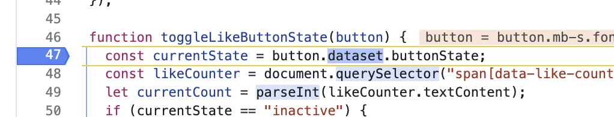
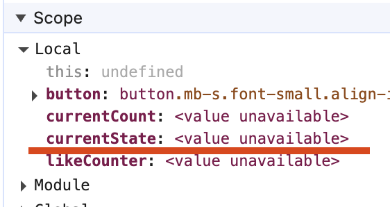
1. Drücke jetzt auf den Button oder F10 einmal
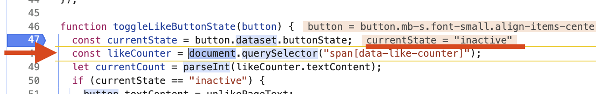
1. Jetzt siehst du das der Zeiger eins weiter gewandert ist und die Variable `currentState` den aktuellen Wert anzeigt. In diesem Fall `inactive`
1. Jetzt kannst du beliebig weiter steppen. Beispielsweise ist es dann spannend, ob beim ersten `if` im code das richtige passiert?
1. Mit jedem Step siehst du auch, wie sich das HTML anpasst, vorausgesetzt, der Schritt ändert auch tatsächlich was. Bei Zeile 50+ werden die Texte, Farben etc. angepasst.
1. Gehe mal ganz durch, bis du wieder "normal" bist und drücke denn Like-Button nochmals. Du solltest dann beim `if` in die andere Variante reinlaufen

## Was kann ich tun, wenn ich nicht weiss in welchem File die Änderung gemacht wird?
1. Wir hatten vorhin "glück" dass wir das File einfach so gefunden haben. 
1. Lösche den aktuellen Breakpoint im buttons.js file wieder. Dies kannst du auf verschiedene Wege. Das einfachste ist wohl einfach nochmals an der Stelle zu klicken und die Markierung sollte verschwinden
1. Gehe dann im Dev-Tool zurück ins Tab "Elements" wo das html angezeigt
1. Suche den Button (oder mit dem Fadenkreuz anwählen) damit du an der richtigen Stell im HTML bist
1. Mache dann einen Rechtsklick und wähle "Break on" -> "subtree modifications"
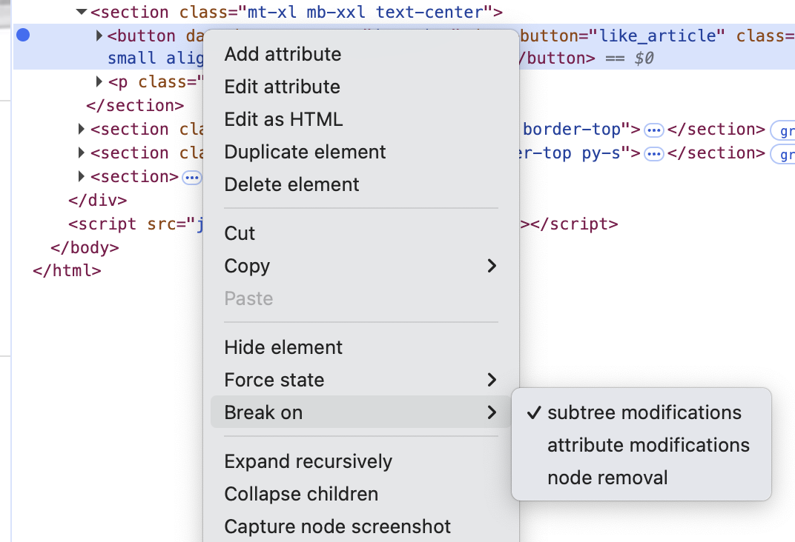
1. Klicke dann nochmals den Button
1. Du solltest an genau der Stelle "breaken" -> pausieren, wo durch das Javascript der Text geändert wird
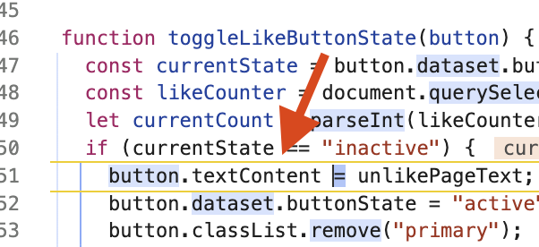
1. Dies ist super hilfreich, wenn du ein Verhalten im HTML prüfen willst und durch welches Javascript das genau ausgelöst wird.
1. Im Debug Tool siehst du alle aktiven Breakpoints. Die dom-Breakpoints kannst du so prüfen und auch wieder löschen
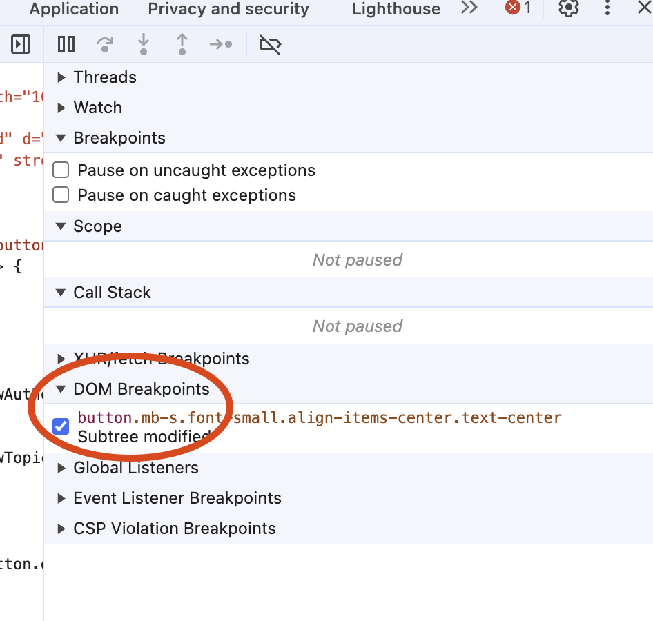
    
## Was wenn ich einfach "egal wo im HTML, wenn es geklickt wird will ich das Javascript finden"?
Auch da hilft dir Chrome…
1. Lösche allfällig vorhandene Breakpoints (inklusive den vorherigen DOM)
2. Gehe dort wo du die DOM Breakpoints siehst weiter nach unten und klappe "Event Listener Breakpoints" auf
3. Wähle "mouse" und dann "click"
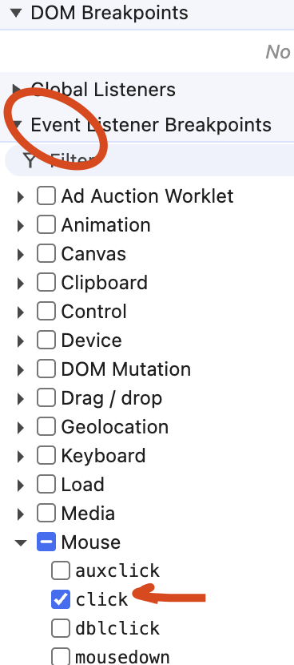
1. Klicke nochmals auf den Button oder auch bewusst dieses Mal auf einen anderen
1. Der Debugger sollte dich automatisch dorthin führen, wo tatsächlich der "Start" Code liegt
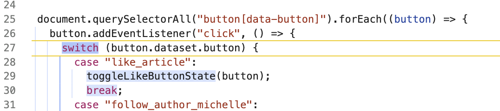

## Und wenn ich aus meinen Code heraus genau sagen will, wo es stoppen soll?
Es kann sein, dass du Zugang zum Code hast, weil du gerade entwickelst. Dann weisst du ev. genau welchen Teil des Skripts du genauer untersuchen möchtest. Alternativ kannst du auch mit VS Code debuggen Debug JavaScript mit Visual Code

Öffne bei dir im VS Code einen Stand mit JavaScript. Entweder das gleiche Beispiel wie oben oder sonst irgendwas anderes. Öffne das JavaScript im VS Code. Gehe beispielsweise zum Buttons.js

Schreibe an der Stelle, an der du den Debugger nutzen willst "debugger;" rein

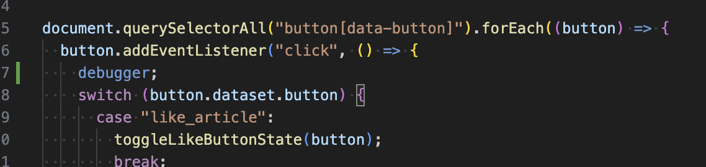

Öffne die Page mit dem LiveServer und dann das Dev Tool wie vorhin. Drücke einen Button.
Der Debugger stoppt an genau der Stelle.

Das kann helfen, wenn du auch verstehen willst, wo dein File/Code genau liegt. Vor allem wenn du mit React, Angular oder ähnlichen Bibliotheken arbeitest, kann es sein, dass dein Code nochmals umgewandelt wird.

Aber Achtung! Du darfst das "debugger" statement natürlich nicht produkiv ausliefern. Sonst stoppt die Page bei allen, die gleichzeitig das Dev Tool öffnen (wenigstens nur dann :D )

### Weitere Infos zum Chrome Debug Tool
Noch viel umfassender findest du die Debug Tools Erklärungen hier https://developer.chrome.com/docs/devtools/javascript?hl=de
