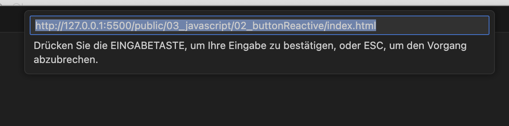
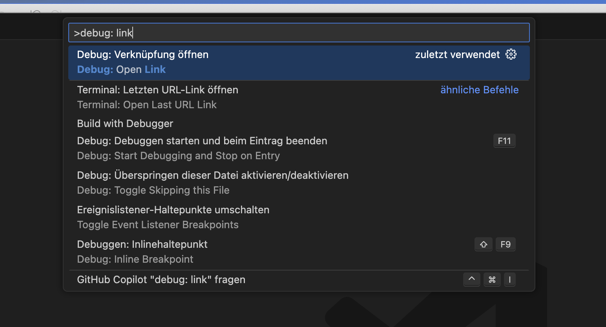
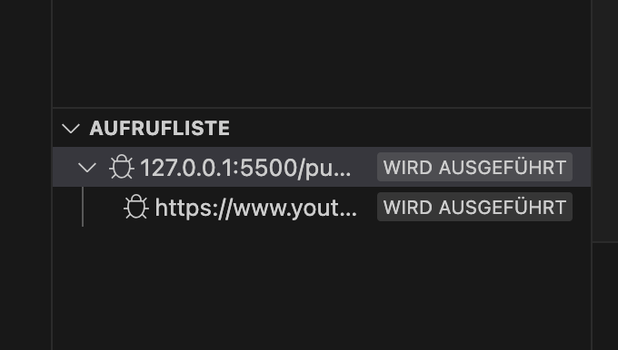
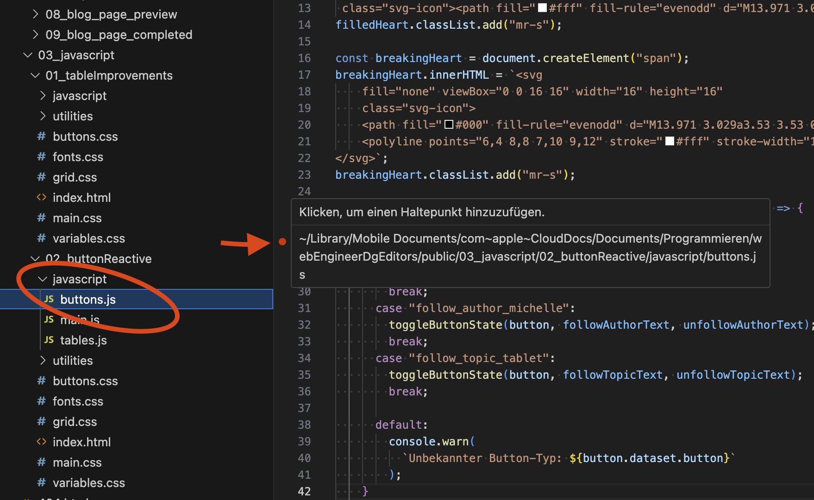
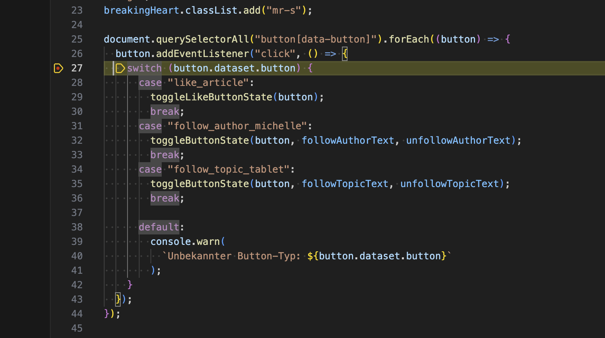
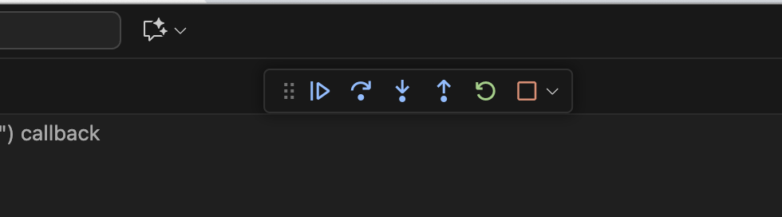
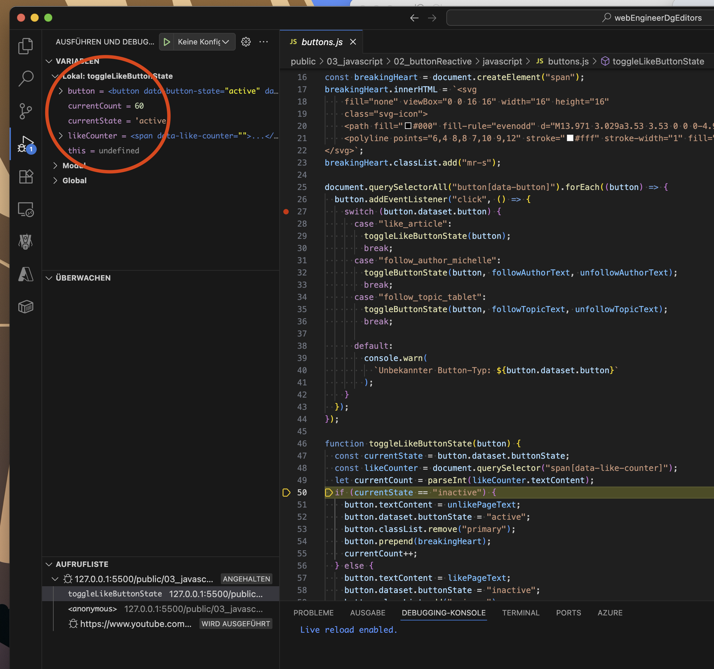
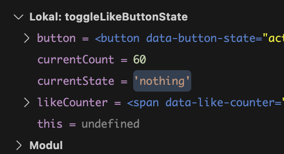

# Debug JavaScript mit VS Code

Wenn dein Code nicht wie erwartet funktioniert, hast du zwei Debugging-Optionen: Browser (Chrome) oder VS Code. Der **Vorteil beim VS Code Debugging** ist, dass du Code korrigieren und sofort die Auswirkungen sehen kannst.

## Zusätzliche Ressourcen

Eine grundlegende Anleitung findest du in der [offiziellen VS Code Dokumentation](https://code.visualstudio.com/docs/debugtest/debugging). Falls das nicht reibungslos funktioniert, verwendet diese Anleitung zusätzlich den **LiveServer** und hat sich in Tests bewährt.

---

## Debug Session starten mit VS Code

### Vorbereitung
1. **Projekt öffnen**: Öffne den Ordner `public/03_javascript/02_buttonReactive` in VS Code  
   *(alternativ ein beliebiges Projekt mit JavaScript und HTML)*
1. **LiveServer starten**: Starte die `index.html` mit deinem LiveServer
1. **URL überprüfen**: Du solltest die Seite über folgende URL sehen:  
   ```
   http://127.0.0.1:5500/public/03_javascript/03_buttonReactive/index.html
   ```

### Debug-Verbindung einrichten
1. **Debug-Panel öffnen**: Gehe zum "Debug"-Bereich in VS Code
1. **Befehlspalette öffnen**: 
   - **Mac**: `Cmd + Shift + P`
   - **Windows/Linux**: `Ctrl + Shift + P`
1. **Befehl eingeben**: Tippe `Debug: link` in die Befehlszeile
1. **Debug-Link öffnen**: Klicke auf das Ergebnis **"Debug: Open Link"**

1. **URL eingeben**: Kopiere die LiveServer-URL und füge sie ein

1. **Verbindung bestätigen**: Der Browser sollte die Seite öffnen und in VS Code solltest du die "Aufrufliste" sehen


### Breakpoints setzen
1. **JavaScript-Datei öffnen**: Gehe zu einer JavaScript-Datei (z.B. `buttons.js`)
1. **Breakpoint setzen**: Klicke am **linken Rand** der gewünschten Zeile  
    → Ein **roter Punkt** wird angezeigt

1. **Code ausführen**: Gehe zurück zur Webseite und führe eine Aktion aus (z.B. Button klicken)
1. **Debugging startet**: Der Debugger stoppt an der markierten Stelle


### Debug-Steuerung
1. **Debug-Toolbar**: Du siehst eine verschiebbare Button-Leiste zur Debugging-Steuerung

1. **Step Over** (`F8`): 
    - Drücke den ersten Button rechts vom Play-Symbol
    - Führt die aktuelle Zeile aus und geht zur nächsten
1. **Step Into** (`F7`):
    - Wenn du wissen möchtest, was sich hinter einer Funktion wie `toggleLikeButtonState(button);` verbirgt
    - Springt **in die Methode hinein** für detaillierte Analyse
1. **Schritt-für-Schritt**:
    - **F7** = Mehr ins Detail (Step Into)
    - **F8** = Überspringen (Step Over)

### Variable inspizieren
1. **Werte anzeigen**: 
    - Fahre mit der Maus über eine Variable und bleibe stehen
    - Der Wert wird direkt angezeigt
    - Zusätzlich gibt es **oben links eine Übersicht** aller Variablen

1. **Werte ändern**: 
    - **Doppelklick** auf eine Variable in der Übersicht
    - Ändere den Wert und bestätige mit `Enter`

1. **Simulation**: 
    - Hilfreich zum Testen: "Wie würde sich der Code verhalten, wenn...?"
    - Ändere Werte temporär zur Simulation verschiedener Szenarien

---

## Weiterführende Informationen

Detaillierte Informationen findest du in der [offiziellen VS Code Debugging-Dokumentation](https://code.visualstudio.com/docs/debugtest/debugging).

---

## Tipps

- **LiveServer** erleichtert das Debugging erheblich
- **Breakpoints** können jederzeit gesetzt/entfernt werden
- **Variablen-Werte** können zur Laufzeit geändert werden
- **Step Into vs. Step Over** je nach gewünschtem Detailgrad verwenden
