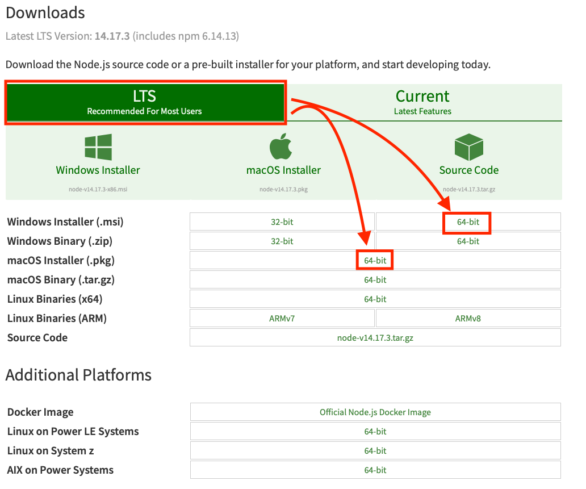

# NodeJS

NodeJS verwenden wir nur im Hintergrund. Dieses Tool ist dafür zuständig, dass dein Computer JavaScript ausführen kann. Da wir eine Webseite programmieren, welche auf JavaScript aufbaut, ist dieses Tool essentiell.

## Download und Installation

Wähle auf der Seite [Node Download](https://nodejs.org/en/download/) LTS und danach die 64-Bit Version von Windows bzw. Mac.

Bei den Installationsschritten kannst du überall den Standard belassen und dich bis zum Abschluss durchklicken.

## Alternative Installation ohne Admin-Rechte

Wenn du keine Admin-Rechte hast, kannst du diese Anleitung verwenden:
[Install without Admin Rights](https://zwbetz.com/install-nodejs-on-windows-without-admin-access/)

## Online-Alternativen

Ansonsten können folgende Online-Tools verwendet werden:

- **Browser** (JavaScript Console)
- **StackBlitz** - Online-Entwicklungsumgebung
- **Programiz Online Compiler** - [online compiler](https://www.programiz.com/javascript/online-compiler/)
- Andere beliebige Node.js Online-Tools

