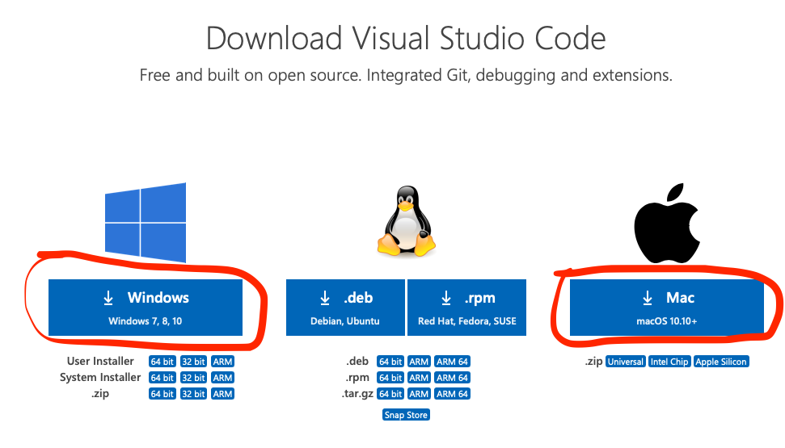
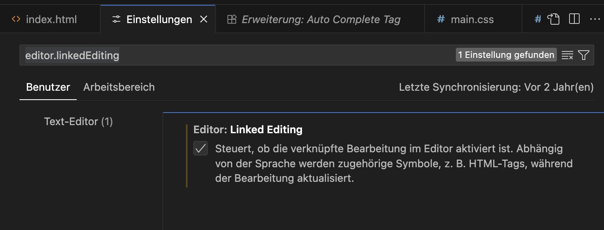
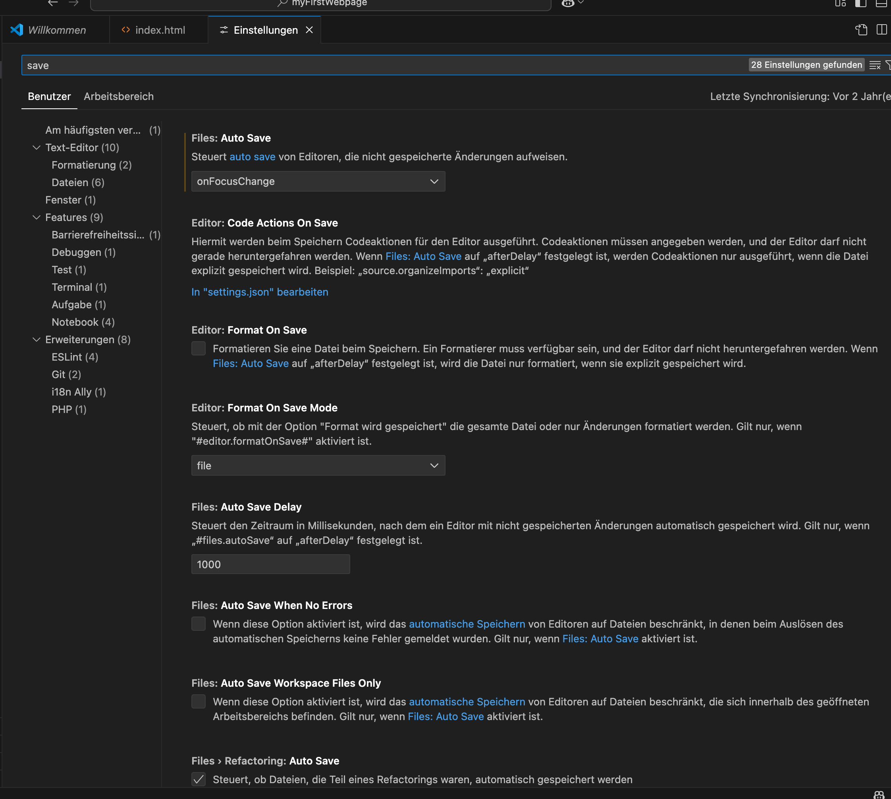
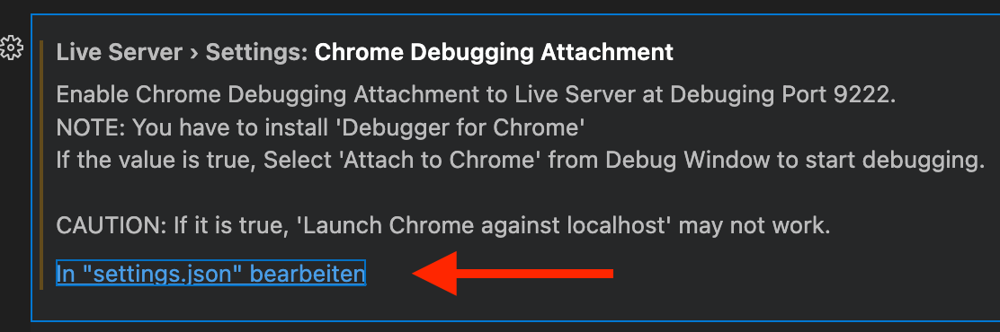
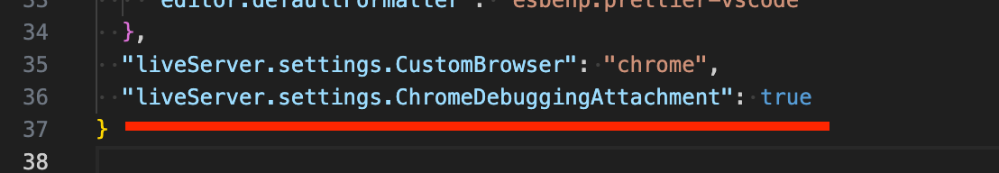
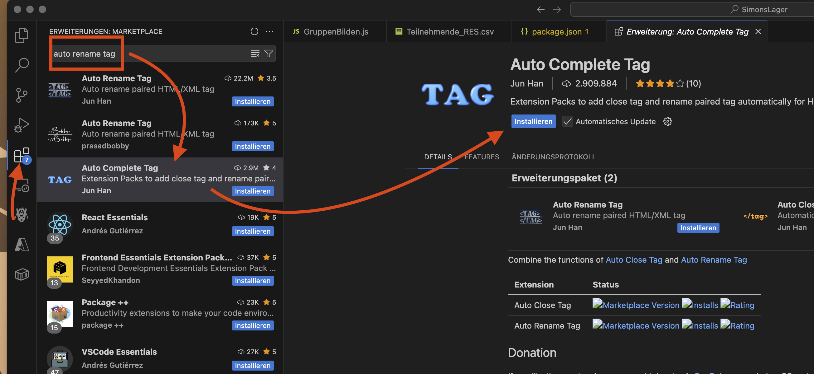

# Visual Studio Code

Visual Studio Code wird das wichtigste während dem Kurs sein. Damit erstellst du den Code für die Webseite. Du wirst rasch sehen, wie viel Unterstützung dir VS Code dabei bietet.

## Download

1. Besuche die Seite [Vs Code Download](https://code.visualstudio.com/download)
2. Wähle die Version deines Betriebssystems und klicke auf den großen Button. Dieser wählt in der Regel die beste Option für deine Arbeitsumgebung.

## Settings

Öffne die Einstellungen im VS Code. Passe folgendes an:

| Suchbegriff | Einstellung |
|-------------|-------------|
| **editor.linkedEditing** | Aktiviere "linked editing" |
| **save** | Überprüfe die Einstellungen zu "save". Mindestens "Auto Save" → onFocusChange aktivieren ergibt Sinn. Zudem kannst du auch einstellen, dass z.B. dein File automatisch formatiert wird |
| **Liveserver** (zuerst Plugin installieren) | Klicke dann auf  und erweitere das JSON so, dass es den Wert fürs Debug Attach auf true hat! |

## Plugins

Sobald du Visual Studio Code (VS Code) installiert hast, öffne es. Damit das Leben mit VS Code noch angenehmer wird, kannst du noch ein paar Plugins installieren. Dafür gehst du in deinem VS Code auf den Bereich "Erweiterungen" und gibst den Namen oben ein. Danach klickst du jeweils auf "Installieren". Die Version kann sich unter Umständen erhöht haben, wenn du die Erweiterungen installierst. Die Angabe unten ist die Mindest-Version.

### Erforderliche Plugins

| Plugin | Version | Beschreibung |
|--------|---------|--------------|
| **Highlight Matching Tag** | 3.x | Färbt Klammern / Code die zusammenpassen ein |
| **Path Intellisense** | 16.x | Vereinfacht die Angabe von Pfaden |
| **Prettier - Code Formatter** | 58.x | Kann den Code automatisch formatieren. Hilft, um eine bessere Übersicht zu haben |
| **Live Server** | 64.x | Web Server, damit die Webseite "richtig" ausgeführt werden kann |

### Optionale Plugins

Für den Kurs nicht zwingend nötig, können aber allenfalls zusätzlich unterstützen:

| Plugin | Version | Beschreibung |
|--------|---------|--------------|
| **German Language Pack for Visual Studio Code** | 4.x | Damit kannst du VS Code in Deutsch nutzen |
